# 2026，写给 AI 创业者的慷慨、残酷、与迷雾

🚥

👦🏻 Koji：

我很推荐这篇文章。

它最打动我的地方，是它没有停留在“AI 很厉害”这种表层兴奋里，而是把今天放回到更长的技术史里去看。对创业者来说，这很重要。因为每一次核心能力被快速商品化，机会会变大，竞争也会变得更残酷：做出来更容易了，但“做什么、为谁做、如何被看见”反而变得更重要。

我自己的感受也是，今天这个时代对创业者既慷慨也残酷。慷慨在于，一个人就能做出过去一个团队才能做出的东西；残酷在于，光会做已经不再是优势了。真正重要的，是判断力、产品感、对用户的理解，以及有没有勇气围绕新能力重写旧问题。

这篇文章值得一读。不是因为它给了答案，而是因为它帮我们把问题看得更清楚。

本文的作者是「加元」，AI 创业者，打造过用户量过百万的 Devv.AI，即将发布新产品。

## 01. 加速的 2026

2026 年 2 月，Andrej Karpathy（前 Tesla AI 总监、OpenAI 创始成员）在 X 上描述了一个非常具体的转折点。

11 月，他的编程工作还是 80% 手写代码、20% 让 agent 处理；到了 12 月，比例完全倒置——80% 用自然语言指挥 agent，20% 自己做编辑和收尾。

他提到最近用自然语言给 AI agent 下达了一连串任务：登录远程服务器、配置 SSH 密钥、安装和测试模型、搭建 Web UI、配置系统服务、编写文档。Agent 在 30 分钟内全部自主完成，过程中遇到多个问题并自行解决。仅仅三个月前，同样的事情还需要花掉一整个周末。

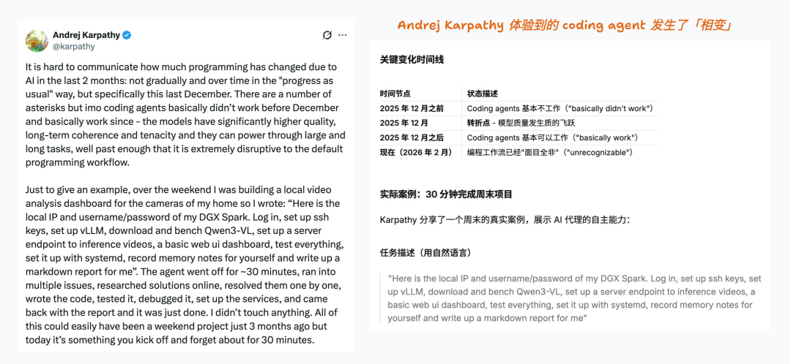

DHH（Ruby on Rails 创始人）的反应同样直截了当：

> "Biggest and fastest change in the 40 years I've tried to make computers do my bidding. And surprisingly, the most fun too!" （使唤计算机 40 年了，这是最大、最快的一次变化——而且出人意料，也是最有趣的。）

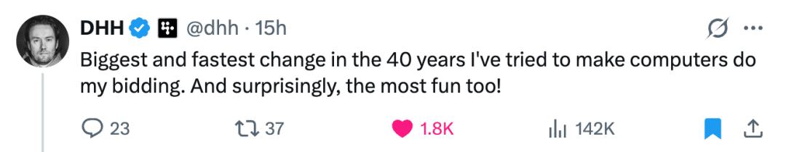

作为 AI 领域一线的创业者，过去 3 个月我也重新回到了 builder 模式——平均每天消耗 100M+ token，提交了 1,000 多次 commit：

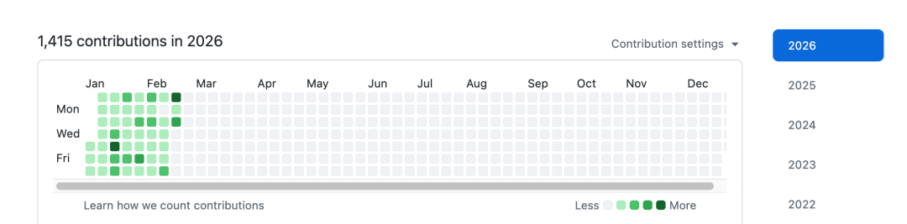

这种加速是真实的。现在 1 个人一周的工作量可能超过过去一个团队几个月的输出。

---

这些加速不只发生在个人层面。2026 年刚过去的两个多月，整个技术世界似乎进入了一个加速期。

**OpenClaw 的爆发。** 这个将 Claude Code 级别的 agent 能力通过 Telegram/Slack 推向大众用户的产品，在 1 月底突然走红。它的成功印证了一个规律：**爆火 = 体验民主化**——把小众用户已有的体验推广到更大的用户群。统一入口、持久化记忆、Skills 组合形成飞轮，让非技术用户第一次感受到"AI 真的能帮我做事"。

**Coding Agent 的能力正在越过临界点。** Claude Code、Codex 等工具已经能够在中等复杂度的代码库（十万行级别）中独立完成任务，人工介入降到最低限度。这不是渐进式的改进——当 AI 从"辅助写代码"变成"主导写代码"时，整个开发流程的逻辑都变了。

**Long-horizon Agent 的突破。** Sequoia 在 1 月发布了一篇标题直白的文章：*"This is AGI"*。他们的定义不是某个 benchmark 分数，而是一个功能性判断：AI agent 现在能够**自主工作数小时，犯错并修正错误，持续迭代直到完成任务**。METR 的数据显示，agent 能处理的任务复杂度大约每 7 个月翻一倍。Sequoia 在文章中基于这一趋势外推：2028 年它们能独立完成相当于人类专家一整天工作量的复杂任务，2034 年是一整年，2037 年是一百年。

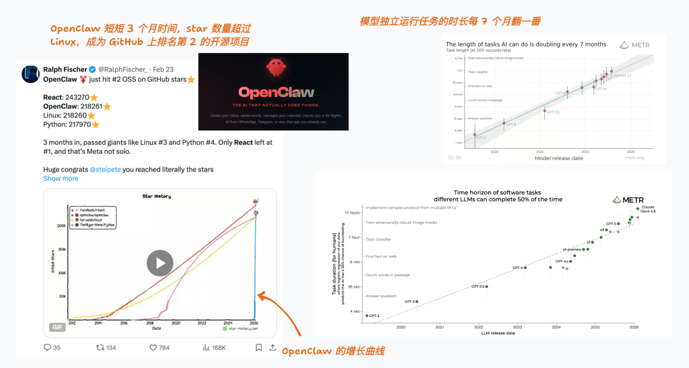

（备注：发布这篇文章的时候 OpenClaw 已经超过了 React，成为了 GitHub 上 star 数最高的代码项目）

**企业层面的结构性变化。**2 月 26 日，Block 创始人 Jack Dorsey 宣布将公司从 10,000+ 人裁至不到 6,000 人——砍掉超过 40%。他把裁员归因于 AI："intelligence tools... are enabling a new way of working which fundamentally changes what it means to build and run a company." 市场的反应直截了当：股价当天暴涨 20%。

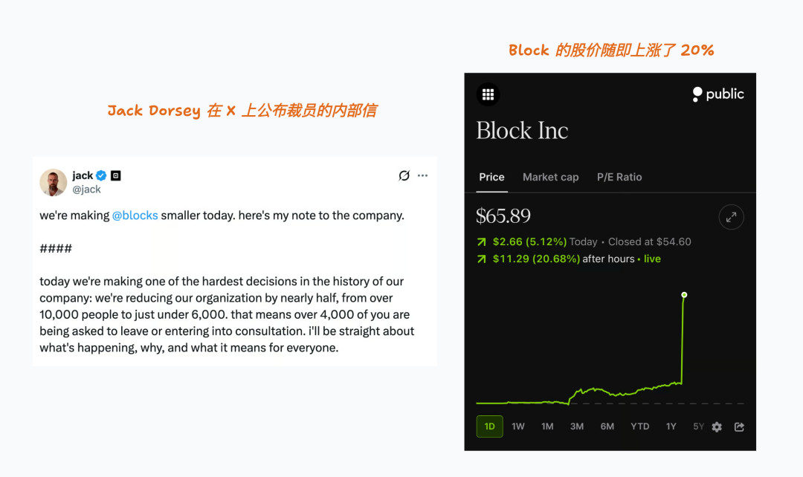

（值得一提的是，批评者认为 Block 的裁员更多是在纠正疫情期间的过度招聘——公司曾从约 4,000 人暴增至 13,000 人。甚至连 Sam Altman 都承认存在"AI washing"现象。但无论裁员的真实原因是什么，市场选择相信 AI 的叙事，这本身就说明了一些事情。）

---

这并不是渐进式的效率提升。核心的爆发点在于：

AI Coding（或者更广义的来说是 Agent）的能力已经越过基线并正在被快速商品化（commoditized）——编程不再是一种需要多年训练才能获得的稀缺能力，而是一种可以按需获取的、接近零边际成本的资源。

但在这股加速中，有一件事让我想停下来想清楚：**这不是第一次发生。** 历史上，每当某种曾经高门槛的能力突然变得廉价且可大规模获取时，都会引发一系列可预测的结构性变化——旧职业衰落、新职业诞生、价值链重组、权力节点迁移。历史不会告诉我们"该做什么"，但至少能告诉我们"什么是错的"。

这篇文章试图回到那些历史时刻的现场，看看当时究竟发生了什么，然后再回到当下，看看它能帮助我们理解什么。

---

##

## 02. 当复制变得免费

##

在古登堡之前，欧洲的每一本书都需要修道院抄写员用手一个字一个字地抄写。一本《圣经》的手抄本价格相当于一个文员三年的工资。整个欧洲的书籍总量大约只有 3 万册。知识的"复制"是一种被教会和少数精英垄断的昂贵能力。

1440 年前后，古登堡在欧洲独立发展出一套实用的金属活字印刷系统（活字印刷的原理最早由北宋毕昇在约 1040 年发明）。到 1455 年，第一本古登堡《圣经》印刷完成。此后，书籍价格以每年约 2.4% 的速度持续下降长达百余年，到 1500 年已下降了三分之二。

一个关键的竞争动态是：当一个新的印刷商进入某个城市市场时，当地书价会立即下降约 25%。到 1480 年，欧洲已有 110 个城市拥有印刷机；到 1500 年，这个数字超过 236 个，书籍总量从 3 万册暴增到 1,000-2,000 万册。

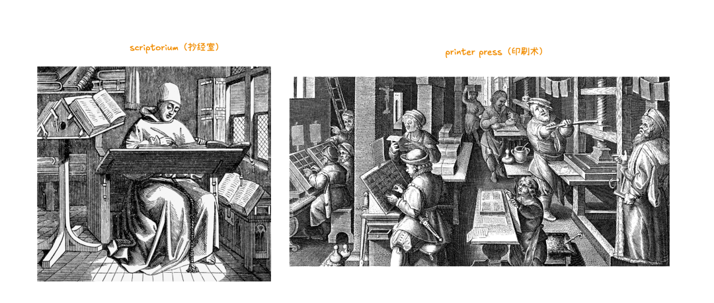

供给端发生了爆炸。但爆炸的后果远不止"书变多了"：

- **旧职业的衰落**：抄写员的需求急剧萎缩，修道院的抄经室（scriptoria）在几十年内走向衰亡。1492 年，修道院院长 Johannes Trithemius 撰写了《论抄写员的荣耀》（*In Praise of Scribes*），试图论证手抄的精神价值。
- **新职业的诞生**：印刷术催生了一整个新的产业链——排版工、校对员、装订工、插画师、出版商、书商。这些职业在古登堡之前根本不存在。
- **供给过剩与质量参差**：大量低质量印刷物涌现——宗教小册子、预言书、色情读物。
- **不可预见的二阶效应**：宗教改革（路德利用印刷术大规模传播观点）、科学革命（学术论文可以跨国流通）、民族国家的兴起（方言出版物强化了国族认同）——这些都不是古登堡能够预见的。

这个故事揭示了一个反复出现的规律。Clayton Christensen 提出过"利润守恒定律"（Law of Conservation of Attractive Profits，吸引力利润守恒定律）：**当价值链的某一层被商品化、利润消失时，相邻层会出现新的专有产品来捕获利润。** Ben Thompson 在分析 Netflix 时将这一逻辑表述得更直白："打破原有的整合系统——商品化并模块化它——会摧毁现有企业的价值，同时让新进入者在价值链的不同部分进行整合并捕获新价值。"

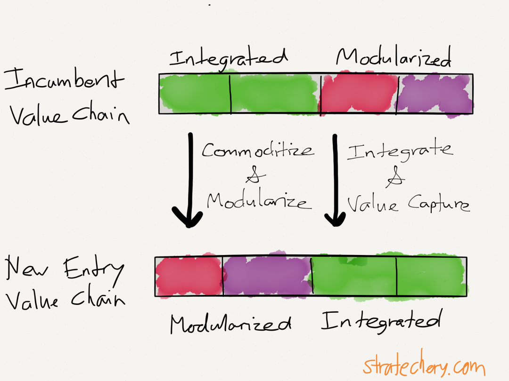

 （图源：Netflix and the Conservation of Attractive Profits by Ben Thompson）

价值不会凭空消失，它只是迁移了。"复制"能力被商品化后，价值从"抄写"迁移到"内容创作"和"策展/发行"。出版商——而非印刷工——成为了新的权力节点。

Joel Spolsky 在 2002 年的文章《Strategy Letter V》中将这一逻辑总结为一个战略原则：**"Commoditize your complement"（商品化你的互补品）**——聪明的公司会主动将互补品商品化，以增加对自身核心产品的需求。微软将 PC 硬件商品化以提高操作系统的价值；Netscape 将浏览器免费化以提高服务器的价值。

商品化还有一个常被忽视的结构性后果：当供给端爆炸时，需求端（注意力、预算、时间）并不会同比例增长。结果是**极端的幂律分布**——头部极少数赢家获得绝大部分价值，长尾的大量产出几乎没有被看到。

印刷术之后 50 年，欧洲书籍从 3 万册增到 2,000 万册，但流传至今的经典只是其中极小的一部分。在供给过剩的世界里，**注意力**本身成了最稀缺的资源。

这种供给端爆炸正在当下重演。a16z 的数据显示，2025 年 12 月 iOS 新应用发布量同比增长 60%，过去 12 个月累计增长 24%——他们将这一现象归因于 agentic coding（也叫"vibe coding"）的兴起。这和 2008 年 iPhone SDK 发布后的 app 爆发如出一辙：当创造门槛骤降时，供给端总会爆炸。

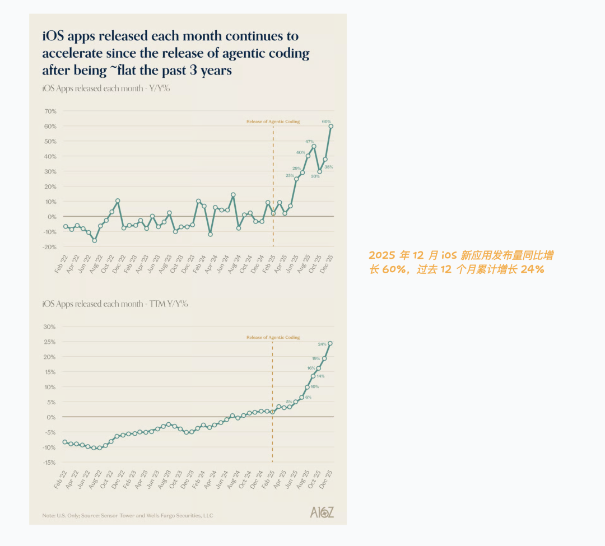

---

##

## 03. 当动力变得廉价

##

19 世纪末，工厂的动力来源是蒸汽机或水车。整个工厂的布局围绕一根巨大的中央传动轴（line shaft）设计：蒸汽机在地下室转动主轴，主轴通过皮带驱动每一层楼的机器。工厂必须建成狭长的多层建筑，所有机器必须紧密排列在传动轴附近。建造一座工厂需要巨额资本——不仅要买机器，还要自建动力系统。

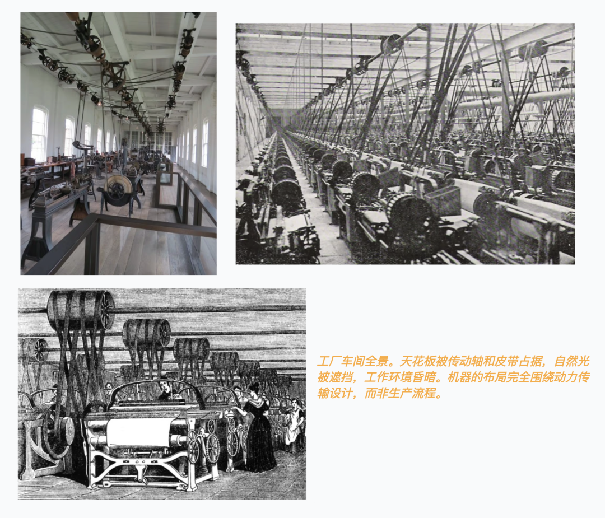

电力改变了这一切。电网让任何工厂都可以"即插即用"获得动力，无需自建蒸汽机。1899 年，电动机仅占美国制造业总动力的 5%；到 1909 年为 23%；到 1929 年已达 77%。这个转变分三个阶段：先是用大型电动机替换蒸汽机驱动原有的传动轴；然后将机器分组，每组用一台较小的电动机驱动；最终，传动轴被彻底废除，每台机器配备自己的独立电动机。

但这里有一个极其重要的教训。

经济学家 Paul David 在 1990 年的著名论文 *"The Dynamo and the Computer: An Historical Perspective on the Modern Productivity Paradox"*（发电机与计算机：现代生产率悖论的历史视角）中指出，从电力商业化（1881 年纽约和伦敦建成发电站）到产生经济层面可度量的生产率提升（1920 年代），中间存在长达**约 40 年的时滞**。一个 1900 年的观察者几乎找不到证据表明"电力革命"正在使商业更高效。

为什么？因为早期的工厂只是把蒸汽机换成了电动机，其他一切不变——布局不变、流程不变、组织方式不变。**他们在用新工具做旧事。**

真正的生产率爆发发生在 1920 年代——制造业全要素生产率（TFP）年增长率高达约 5%，占整个经济体 TFP 增长的 84%——当新一代工厂完全围绕电力的特性重新设计时：单层建筑取代了多层建筑，机器可以按照工艺流程而非动力传输来布局，工厂变得更明亮、更安全。这最终催生了福特的流水线。福特的工厂不是"用电力驱动的旧工厂"，而是"围绕电力特性设计的全新生产系统"。

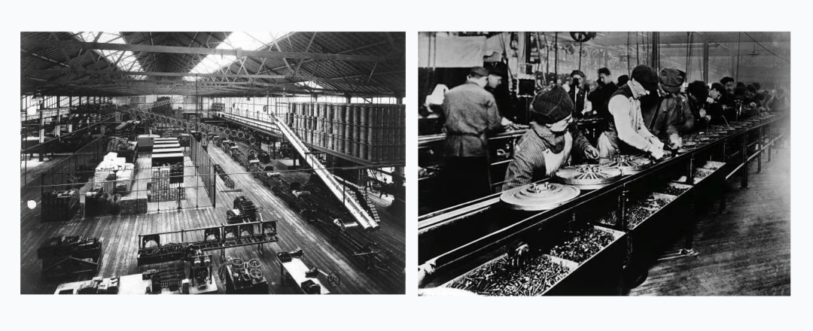

这和 Robert Solow 在 1987 年提出的 IT 生产率悖论形成了跨越百年的回响——"You can see the computer age everywhere but in the productivity statistics"（你到处都能看到计算机时代，唯独在生产率统计中看不到）。Erik Brynjolfsson 在 1993 年的研究中证实：尽管 1970-1980 年代美国计算能力增长了百倍，劳动生产率年增速却从 1960 年代的 3% 以上下降到了约 1%。**只有当技术投资伴随着互补性的组织变革时，生产率才会提升**——和电力的故事如出一辙。

同样的悖论正在 AI coding 领域重演。METR 在 2025 年进行的一项严格随机对照实验发现：当 16 名有经验的开源开发者在自己熟悉的项目（平均维护了 5 年）上使用 AI 工具时，完成任务的时间反而**慢了 19%**——而实验前，这些开发者预期会快 24%。更大规模的调查显示，75% 的工程师在使用 AI 工具，但大多数组织看不到可衡量的绩效提升。原因是什么？AI 加速了代码生成这一个环节，却在代码审查、集成、测试等环节制造了新的瓶颈——就像在流水线上只加速一台机器，你得到的不是更快的工厂，而是更大的堆积。

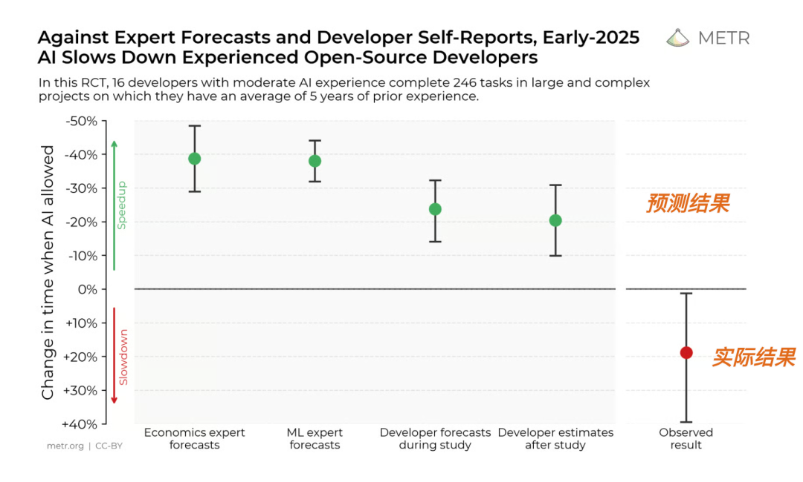

但这并不意味着 AI coding 没有价值。关键在于**谁在用**和**怎么用**。Karpathy 的例子——一个周末的项目压缩到 30 分钟——恰恰说明：当使用者本身有足够的系统架构能力和判断力时，AI 是一个巨大的杠杆。METR 实验中的开发者在"熟悉的项目"上变慢，可能正是因为旧的工作流程没有为 AI 优化。真正的效率提升，需要围绕 AI 的特性重新设计整个工作方式——和电力的故事一样。

---

##

## 04. 当门槛坍塌

##

在 AWS 之前，做一个互联网服务需要购买服务器、租用机房、雇运维团队。Marc Andreessen 在 *"Why Software Is Eating the World"*（为什么软件正在吞噬世界）中回忆：2000 年，他的合伙人 Ben Horowitz 担任 Loudcloud CEO 时，一个客户运行一个基本互联网应用的成本约为每月 15 万美元。

2006 年，AWS 推出 S3 和 EC2。到 2011 年，同样的应用在 AWS 上运行只需约每月 1,500 美元——成本下降了 **100 倍**。AWS 在 2006 年至 2014 年间进行了超过 60 次降价；S3 存储成本在 12 年间累计下降了 86%（从 0.5/GB 到 0.022/GB）。

门槛的坍塌引发了创业爆炸。启动一家互联网公司的资本门槛从百万级降到了几千美元。Y Combinator 之所以能在 2005 年成立并以极少的种子资金（最初仅约 $20,000）支持创业者，正是因为基础设施成本的剧变。Instagram 被 Facebook 以 10 亿美元收购时只有 13 名员工。Airbnb、Dropbox、Stripe 这些公司之所以能存在，是因为它们不需要自己建数据中心。

SaaS 市场从 2015 年的 314 亿美元增长到 2024 年的 2,500 亿美元以上，仅美国就有超过 16,500 家 SaaS 公司。但每个垂直领域最终收敛到 2-3 家赢家——又一次幂律分布，和印刷术之后的供给爆炸遵循着同样的规律。价值从"有服务器"迁移到"有用户"，再到"有数据飞轮"和"有网络效应"。

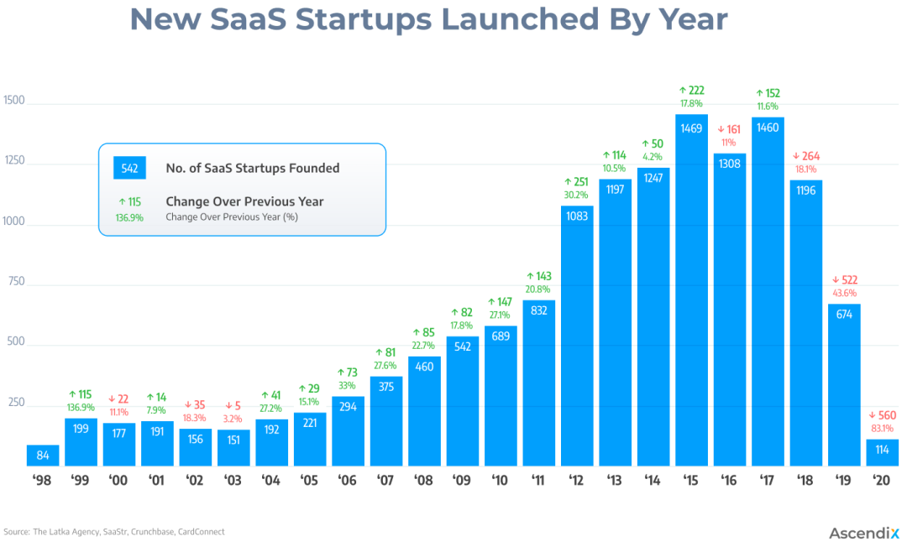

这种供给端的爆炸还伴随着一个反复出现的周期：**先 Unbundle（解构），再 Re-bundle（重组）。**

Jim Barksdale 有一句名言："There are only two ways to make money in business: One is to bundle; the other is to unbundle."（商业中只有两种赚钱方式：一种是打包，另一种是拆包。）当某种能力变得廉价，原来的一体化解决方案被拆散成更小的、专注的产品。但当碎片化到达极端时，新的整合者会出现，将这些碎片重新组合成一种新的一体化体验。

这个循环在历史中一再上演：

- 印刷术先 unbundle 了教会对知识的垄断，然后出版商 re-bundle 了内容策展和分发。
- 云计算先 unbundle 了 IT 基础设施，然后 AWS/GCP/Azure re-bundle 成了新的一体化云平台。
- 新闻业先被博客和社交媒体 unbundle——记者可以绕过报社直接发布，读者可以单篇阅读而非订阅整份报纸。然后 Substack 和付费 Newsletter re-bundle 了独立写作：作者获得直接的订阅关系，读者获得策展过的内容包。价值从"拥有印刷机"迁移到"拥有读者信任"。

---

##

## 05. 商品化的规律

##

三个跨越数百年的故事——印刷机、电动机、云服务器——遵循着相同的规律：

| 被商品化的层 | 价值迁移到的层 |
| --- | --- |
| 抄写 → | 内容创作 & 出版 |
| 工厂动力 → | 生产流程设计 |
| 服务器基础设施 → | 应用层体验 & 网络效应 |
| **代码编写 →** | **问题定义、产品判断、用户获取** |

AI 正在商品化 coding，但没有商品化"解决什么问题"。当"如何实现"不再是瓶颈，"实现什么"和"为谁实现"成为可能的差异化因素。

同样的幂律分布正在 AI agent 赛道重现：无数复制品涌现，但马太效应极强——不是因为后来者做得差，而是因为在供给过剩的世界里，注意力本身成了最稀缺的资源。用 AI 加速构建过去形态的 SaaS 产品——"AI 帮你更快地做一个 CRM"——本质上就是把蒸汽机换成电动机，防御力极低。围绕"代码生产零边际成本"这一新现实重新设计产品形态，才是真正的机会。

而 AI coding 领域正处于 **unbundling 阶段**：标准化工具的价值正在降低，长尾的、个性化定制的工具价值在提高。但历史告诉我们，这之后必然会有 re-bundling。

---

##

## 06. 我们现在在哪里

##

经济学家 Carlota Perez 提出了一个有影响力的框架，描述每一次技术革命都经历两个大阶段。

- **安装期**（Installation Period）：新技术进入市场，基础设施被建设，金融资本大量涌入，催生投机泡沫，这个阶段的特征是混乱、实验、过度投资。
- **转折点**（Turning Point）：泡沫破裂，衰退来临，制度性框架开始调整以适应新技术。
- **部署期**（Deployment Period）：技术被广泛采纳到主流社会，如果制度安排得当，可以进入"黄金时代"——技术的全部潜力被释放。

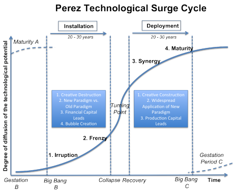

| 技术革命 | 安装期 | 转折点 | 部署期 |
| --- | --- | --- | --- |
| 铁路 | 1830s-1840s（铁路狂热） | 1847 铁路泡沫破裂 | 1850s-1870s |
| 电力/重工业 | 1880s-1920s | 1929 大萧条 | 1930s-1960s |
| 互联网/IT | 1990s | 2000 互联网泡沫 | 2003-2020s |
| **AI** | **2023-?** | **?** | **?** |

如果 Perez 的框架成立，AI 目前正处于安装期的早期——大量资本涌入、实验室遍地开花、共识赛道极度拥挤。这个阶段的特征恰恰是我们看到的景象：供给过剩、大量复制品、马太效应极强。安装期的后半段，通常会出现投机泡沫。泡沫破裂之后，才会进入真正的"部署期"——此时基础设施已经成熟，制度性框架已经适应，技术的全部潜力才开始被释放。**根据这个框架，最大的价值创造通常发生在部署期，而非安装期。**

---

##

## 07. 可能发生什么

##

**程序员不会消失，但"程序员"的定义会改变。** 就像抄写员没有在一夜之间消失——即使在印刷术发明几十年后，手抄本仍然在被委托制作——也像蒸汽动力工厂在电力普及后并未立刻消失。但竞争的差异化因素会从"能不能写代码"变成"系统设计和架构判断"。

这里有一个重要的区分：**技术替代的是"任务"，而不是"人"**。那些可以被拆解成明确步骤的工作——无论是认知性的（如数据录入）还是体力性的（如流水线装配）——会被技术替代；而那些需要判断力、创造力、复杂沟通的工作，反而会被技术放大。结果是：高端技能更值钱，中端技能被商品化，从业者被挤向两端。

同样，程序员的价值将从"能写代码"这一越来越常规化的任务，迁移到系统架构判断力、产品直觉、品味，以及复杂系统的调试与整合——这些仍然是非常规任务。

**最大的受益者不是"用 AI 写代码最快的人"。** 历史上每次商品化，最大的受益者往往不是执行更快的人，而是重新定义了游戏规则的人。古登堡不是最大赢家，出版商和作者是。电力公司不是最大赢家，福特是。AWS 当然是赢家，但 Airbnb 和 Stripe 同样是——它们利用被商品化的基础设施，创造了此前不可能存在的商业模式。当 coding 被商品化后，赢家可能不是"用 AI 写代码最快的人"，而是那些利用零边际成本的代码生产能力，去重新定义产品形态、分发方式、或价值捕获模式的人。

**Unbundling 之后，Re-bundling 的机会正在酝酿。** 当前我们正处于 unbundling 阶段——标准化工具被拆散，长尾个性化工具涌现（参考最近的 SaaS vs 个性化 Agent 的变化）。但如果历史的模式成立，这些碎片化的长尾工具最终会需要一个新的整合层。它可能是一个让 AI 生成的一次性工具可以被发现和复用的"应用商店"，可能是一个让用户将多个长尾工具像乐高一样组装的"组合式平台"，也可能是一个将生成、运行和管理代码的能力作为底层原语的"AI 原生操作系统"。

**而电力的四十年教训提醒我们保持耐心。** 我们现在对 AI 的使用方式——让它更快地写出传统形态的软件——很可能只是"用电动机替换蒸汽机"阶段。真正的"流水线时刻"——围绕 AI 能力的特性重新设计整个软件范式——可能还需要数年甚至更长时间才会到来。但当它到来时，它可能催生出此前不可能存在的全新产品形态：

- **一次性软件**，为一个特定场景、一个特定用户构建的定制工具，用完即弃；
- **自适应软件**，根据用户行为实时生成和修改自己代码的应用；
- **超长尾软件**，为每一个细分到不可思议的需求构建专属产品。

但有一点需要注意：AI 的发展速度远超电力时代。电力革命的 40 年时滞部分源于物理基础设施的建设周期——电网、工厂、培训工人都需要时间。而 AI 的"基础设施"是软件和算力，迭代周期以月计算。McKinsey 2025 年的调查发现，那些在采用 AI 之前就重新设计了端到端工作流的组织，获得显著财务回报的可能性是其他组织的近三倍。这暗示着：**"流水线时刻"不会等 40 年，它可能就在未来几年**。

---

##

## 08. 这是创业最坏的时代

##

如果前面的分析是对的，那么对于创业者来说，这既是最好的时代，也是最残酷的时代。

**好的一面显而易见**：构建产品的门槛从未如此之低。一个人、一个周末、几百美元的 API 费用，就能做出过去需要一个团队几个月才能完成的东西。想法到原型的距离被压缩到了极限。"能不能做出来"不再是问题。

**但这正是地狱模式的起点**：当每个人都能快速构建产品时，"做出来"本身就不再是竞争优势。你能用一个周末做出来的东西，别人也能。你今天的创新，明天就会被复制。

这导致了几个残酷的现实：

**竞争烈度指数级上升。** 每个赛道都挤满了人。因为进入门槛低了，所以进入的人多了；因为迭代速度快了，所以每个人都在疯狂发布。你不再是和几个竞争对手赛跑，而是和整个互联网上能想到同样点子的人赛跑。

**注意力成为终极瓶颈。** 在供给过剩的世界里，被看到比做出来更难。Product Hunt 每天有几十个新产品发布，X 上每小时都有人在演示新的 AI 工具。获取用户注意力的成本——无论是付费获客还是内容营销——正在快速上升，而产品本身的差异化却在下降。

**赢家通吃的马太效应极强。** 历史告诉我们，每次供给端爆炸之后，价值都会向头部极度集中。这意味着：中等水平的成功可能会消失。要么成为赛道的头部玩家，要么在长尾中艰难求生。

**护城河正在坍塌。** 传统软件公司的护城河——技术复杂度、工程团队规模、多年积累的代码库——在 AI 面前变得脆弱。Nicolas Bustamante 分析了垂直软件的十大护城河在 LLM 时代的命运：**五道正在坍塌**（习得型界面、定制业务逻辑、公开数据访问、稀缺人才、捆绑销售），**五道依然坚固**（专有数据、监管合规、网络效应、交易嵌入、记录系统地位）。关键洞察是：被摧毁的恰恰是那些曾经阻止竞争者进入的护城河。

简单说：**如果你的优势在于"怎么做"，你正在被商品化；如果你的优势在于"有什么"（数据、用户、合规资质），你反而更安全了。**

---

##

## 09. 在地狱模式里生存

##

那么，在这个地狱模式里，什么样的策略可能是有效的？

**不要用 AI 做旧事。** 用 AI 更快地做一个传统 SaaS，本质上就是把蒸汽机换成电动机。你需要问的问题是：如果代码生产成本为零，什么产品形态是之前不可能存在的？一次性软件？自适应软件？超个性化体验？

（当然，短期内"用 AI 更快做旧事"确实存在套利窗口——在竞争对手还没反应过来之前，你可以用更低的成本、更快的速度抢占市场。但这个窗口会迅速关闭，因为你能做的，别人也能做。）

**护城河要建在代码之外。** 如果代码本身不再是壁垒，那么壁垒只能来自：独特的数据资产、强大的用户关系、难以复制的分发渠道、或者品牌和社区。

**速度仍然重要，但方向比速度更重要。** 在一个人人都能快速执行的世界里，判断力——知道该做什么、为谁做——成为真正的差异化因素。慢下来思考正确的问题，可能比快速执行错误的答案更有价值。

**拥抱 unbundling，同时寻找 re-bundling 的机会。** 当前是 unbundling 阶段——长尾工具涌现，标准化产品被拆散。但历史告诉我们，re-bundling 必然到来。问自己：这些碎片化的工具最终需要什么样的整合层？谁来提供？

**接受这是一场持久战。** 安装期的混乱可能还要持续数年。这不是一个"快速找到 PMF 然后规模化"的时代，而是一个需要不断适应、不断重新定义自己的时代。耐心和韧性可能比任何单一技能都重要。

---

##

## 10. 不破不立

##

历史上每一次重大的商品化，都伴随着一种特殊的痛苦：那些在旧秩序中积累了优势的人，发现自己的优势正在蒸发。抄写员花了十年练就的字迹，在印刷机面前一文不值。工厂主花巨资建造的传动轴系统，在电力时代成了负担。程序员花了多年积累的编码技能，正在被 AI 以月为单位追平。

但"不破不立"的另一面是：**旧优势的消失，也意味着旧壁垒的消失。** 那些曾经因为没有资源、没有团队、没有工程能力而被排斥在外的人，现在可以参与竞争了。那些曾经需要数百人、数千万美元才能做的事情，现在一个人、一个周末就可以开始。

这是为什么说我们站在变革的开端。

不是因为 AI 会取代所有人的工作——历史告诉我们，技术很少直接"消灭"职业，它更多是重新定义职业的内涵。

而是因为：**当一种核心能力被商品化时，整个价值链都会重组。** 而价值链重组的时刻，恰恰是新玩家入场、新规则被书写的时刻。

古登堡不知道印刷术会催生宗教改革。福特不知道流水线会重塑中产阶级。2006 年 AWS 刚推出时，没有人能预见到 Airbnb 和 Stripe 这样的公司会因此成为可能。

同样，我们今天也不知道，当 coding 被彻底商品化之后，会涌现出什么样的新产品形态、新商业模式、新的价值创造方式。

但有一件事是确定的：那些最先理解新规则、最先围绕新能力重新设计自己的人——无论是个人、团队还是公司——将在新秩序中占据先机。

不破，不立。

---

##

## 参考文献

##

1. Autor, D.H., Levy, F., & Murnane, R.J. (2003). "The Skill Content of Recent Technological Change: An Empirical Exploration." *The Quarterly Journal of Economics*, 118(4), 1279-1333. https://doi.org/10.1162/003355303322552801
2. Brynjolfsson, E. (1993). "The Productivity Paradox of Information Technology." *Communications of the ACM*, 36(12), 66-77.
3. Christensen, C. & Raynor, M. (2003). *The Innovator's Solution: Creating and Sustaining Successful Growth*. Harvard Business School Press.
4. David, P.A. (1990). "The Dynamo and the Computer: An Historical Perspective on the Modern Productivity Paradox." *American Economic Review*, 80(2), 355-361.
5. Dittmar, J. (2011). "Information Technology and Economic Change: The Impact of The Printing Press." *The Quarterly Journal of Economics*, 126(3), 1133-1172.
6. Dittmar, J. & Seabold, S. (2019). "New Media and Competition: Printing and Europe's Transformation after Gutenberg." *CEP Discussion Paper No. 1600*.
7. Perez, C. (2002). *Technological Revolutions and Financial Capital: The Dynamics of Bubbles and Golden Ages*. Edward Elgar Publishing.
8. Solow, R. (1987). "We'd better watch out." *New York Times Book Review*, July 12, p.36.
9. Andreessen, M. (2011). "Why Software Is Eating the World." *Wall Street Journal*. https://a16z.com/why-software-is-eating-the-world/
10. Bustamante, N. (2026). "The Crumbling Workflow Moat." https://www.nicolasbustamante.com/p/the-crumbling-workflow-moat-aggregation
11. Grady, P. & Huang, S. (2026). "2026: This is AGI." *Sequoia Capital*. https://sequoiacap.com/article/2026-this-is-agi/
12. Spolsky, J. (2002). "Strategy Letter V." https://www.joelonsoftware.com/2002/06/12/strategy-letter-v/
13. Thompson, B. (2015). "Netflix and the Conservation of Attractive Profits." *Stratechery*. https://stratechery.com/2015/netflix-and-the-conservation-of-attractive-profits/
14. a16z. (2025). "Charts of the Week: The Almighty Consumer." https://www.a16z.news/p/charts-of-the-week-the-almighty-consumer
15. McKinsey & Company. (2025). "The State of AI 2025." https://www.mckinsey.com/capabilities/quantumblack/our-insights/the-state-of-ai
16. METR. (2025). "Measuring AI Ability to Complete Long Tasks." https://metr.org/blog/2025-03-19-measuring-ai-ability-to-complete-long-tasks/
17. METR. (2025). "Early 2025 AI Experienced OS Dev Study." https://metr.org/blog/2025-07-10-early-2025-ai-experienced-os-dev-study/
18. Buringh, E. & Van Zanden, J.L. (2009). "Charting the 'Rise of the West': Manuscripts and Printed Books in Europe." *The Journal of Economic History*, 69(2), 409-445.
19. CBO. (2013). "Total Factor Productivity Growth in Historical Perspective." Working Paper 2013-01.
20. AWS. (2006-2018). S3 定价历史数据.
21. Y Combinator 创立历史 (2005). https://paulgraham.com/ycstart.html1
