# 当 MiniMax 遇见 OpenClaw：「1 2 3 上链接」

> 当我们把 OpenClaw 连进 MiniMax 专家 Agent。

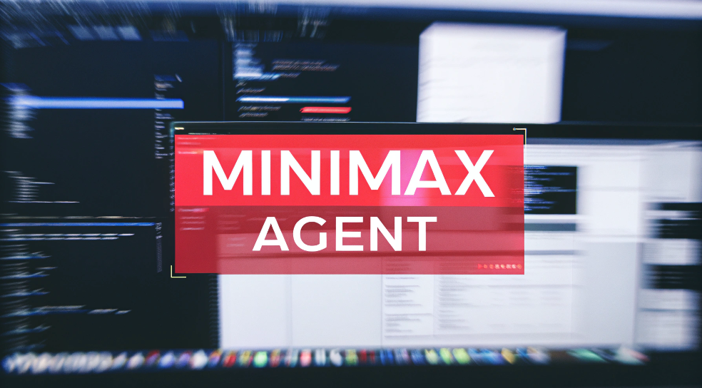

👦🏻 作者: 镜山

🥷 编辑: Koji

🧑‍🎨 排版: NCon


春节前，各大 AI 厂商该发模型的都发了，各种行动一起上，很像是「节前大促」。

MiniMax、智谱、Kimi、豆包、Claude、Gemini、OpenAI 一个接一个，参数、榜单、速度、价格都提升了好几轮。

春节之后，应用层这边开始动了。

前天，MiniMax 更新了 MiniMax Agent，原先的专家 Agent 再度升级，这次还加了个新东西：MaxClaw —— 把最近在 GitHub 上爆火的 OpenClaw 做成了网页版，直接一键接入。

OpenClaw 你大概率听说过。这是一个把 AI 接进飞书、钉钉、Telegram 这些 IM 工具的 Agent 框架，今年 1 月在 GitHub 快速涨星，现在已经拿到了 22.4K Star。

不过，在各个社区都出现了「我想用但不会装、容易报错、手动装 API 等流程还是门槛太高」的评论，所以 MiniMax Agent 这回的「降低门槛」就是围绕着这个切入点所做出的行动。

### 🚥

接下来，我们想结合几个真实办公和创作场景，做一次完整实测。

## MaxClaw

首先，这次 MiniMax Agent 最大的更新就是推出了 MaxClaw，背后是 MiniMax 2.5 模型作为支撑，这个模型也是赶上 OpenClaw 的爆发期，在 OpenRouter 上调用量猛增。

简单说就是网页版的 OpenClaw，它就是你的专属私人 AI Agent，你可以给它自定义一个性格和角色，甚至是 Soul，之后所有对话的记忆都会被储存在 Agent 里。功能上，它能 7 X 24 小时运行，一直在云端工作，对话的界面可以是 MiniMax Agent 网页，也可以是其他 IM 产品（Slack、飞书、Telegram）的聊天对话框。

而且，由于是在 MiniMax Agent 里部署和配置，所以门槛低了不少，不用折腾环境配置那些东西了。

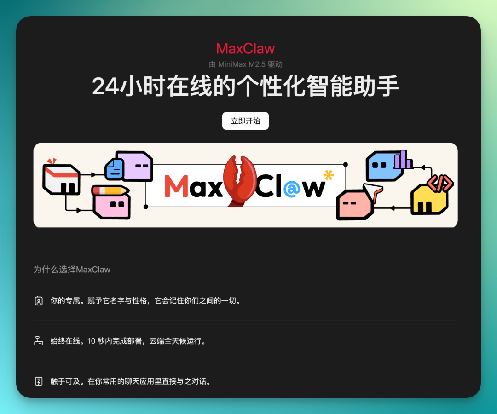

MaxClaw 本身就是跑在 MiniMax Agent 上的，所以你可以直接在里面选专家配置，一句话就能把 MiniMax 版的 OpenClaw 部署到云端。

门槛很低，不用自己搭环境。

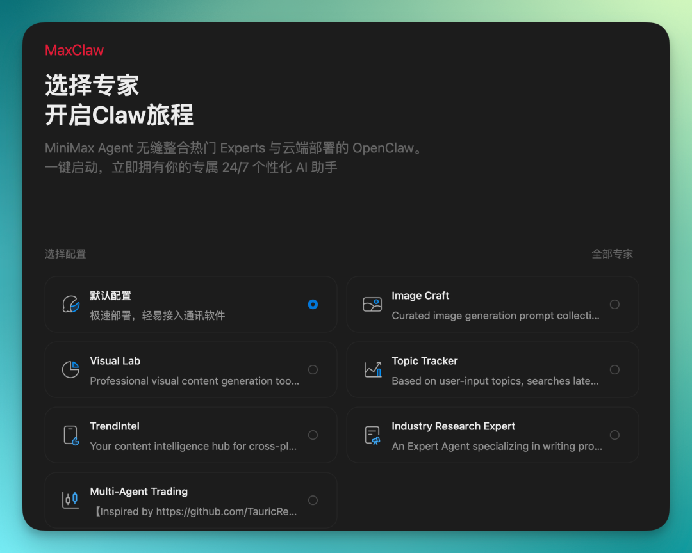

先来试试它能做什么。

随便给它一个最近的热点，让它搜相关新闻、给出链接、配图、再写文案，整套任务一起跑。

提示词如下：

```
我听说Anthropic大规模数据清洗纸质书？ 帮我找到相关新闻我要写一篇小红书文章，需要一些真实配图，把小红书文案给我，
```

MaxClaw 给出的回答很有结构。

新闻内容整理得很清楚，关键点都有，还附上了相关报道的链接。甚至还会给你一份配图清单，每张图都可以直接复制下载。

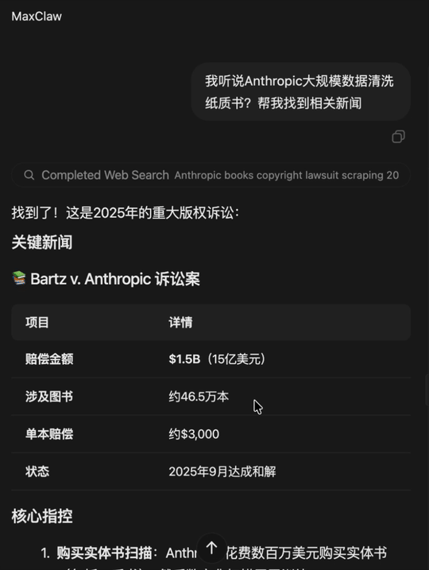

而且它找配图的方式也挺灵活。

不只是给你这个 CEO 的正面照，还会顺带把公司产品界面、发布会现场、相关新闻截图一起找出来。

有时候甚至会多给几种尺寸和构图，这样拼一拼，其实一篇内容的配图就差不多齐了。

对做内容批量分发的人来说，这一步其实比较省时间，不用自己去各个平台翻素材，也不用再单独开图搜网站。

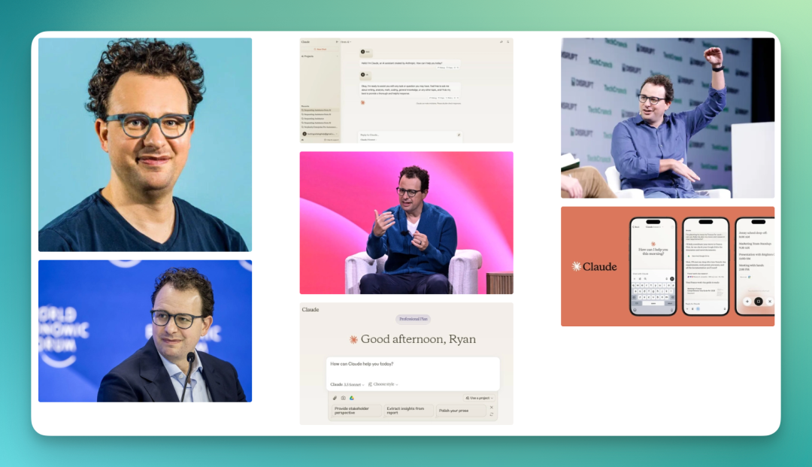

虽然门槛低，但它内置的 Skills 其实挺成熟的。而且它兼容 OpenClaw 原本的 ClawHub Skills，不用重新折腾。

你可以直接让它把上面那些配图和文字内容存进 Notion，创建一个 Notion 新集成就行了。

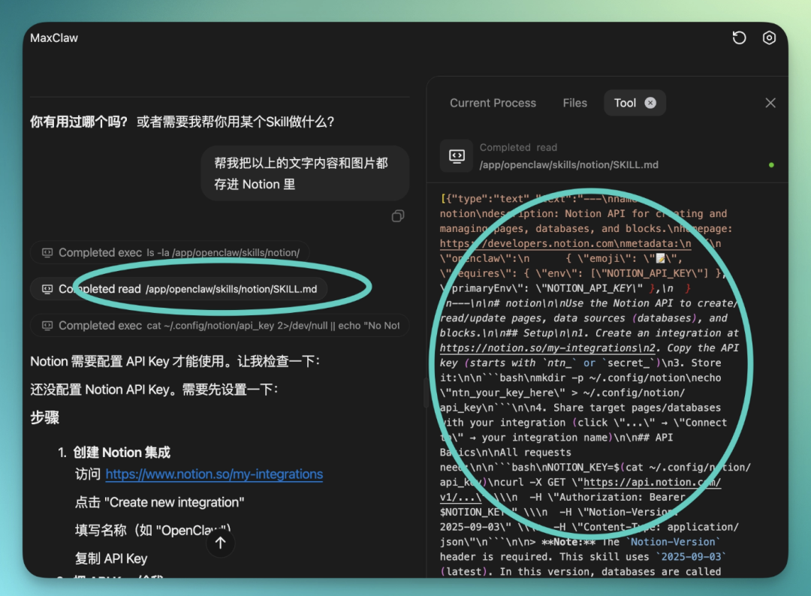

再用 ArXiv 论文搜索 Skills，搭配存入 Notion 的 Skill，就能做一个实时的 ArXiv AI 论文监控器。

论文链接、日期、标题都给你整理好，格式也很清楚，直接存进 Notion 里。

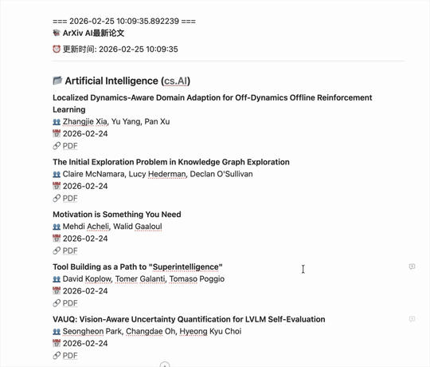

我现在还在用它整理 CVPR 2026 的 GitHub 仓库，定时汇报、监控、归类，这些事我都让它定时去跑。到点自动汇报，更新列表，顺便帮我做分类。

我只需要看它整理好的结果，重点项目再自己点进去细看。

更方便的是，我把这些流程都封装成了 MiniMax Agent 新升级的专家 Agent。以后想监控新的会议，或者换成别的主题，直接调用技能就行，不用从头再教一遍。

等于做成了一个可以反复用的工具。

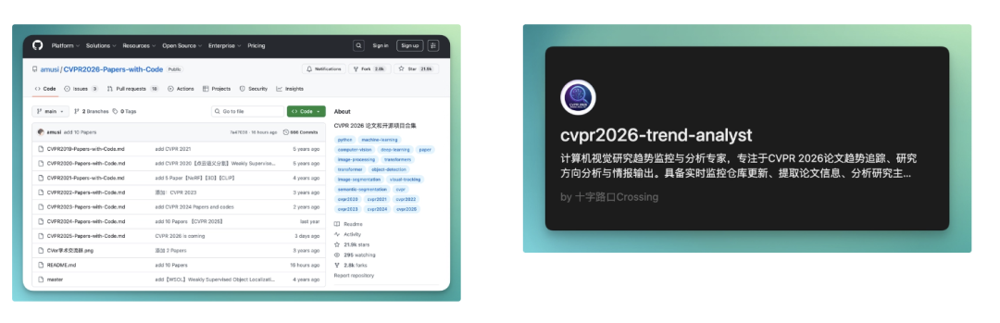

和 OpenClaw 一样，MaxClaw 也可以直接接入 Slack、飞书这些常用的 IM 工具。

我这边因为飞书里已经跑了一个 OpenClaw，不想来回折腾，所以这次就选了 Slack 来连。逻辑是一样的，只是平台不同。

如果你完全不知道怎么操作，也不用慌。最简单的方式就是直接在 MaxClaw 里问它怎么接 Slack。它会一步一步告诉你该做什么。

先去 Slack 的 API 网站创建一个 App，把需要的权限勾上，然后发布。接着 Slack 会给你几段关键的代码，一般是 3 个。把这 3 个码复制出来，粘贴给 MaxClaw。

后面基本就是按提示确认、保存、重启。照着做一遍就能跑起来，不需要写代码，也不用自己查文档。

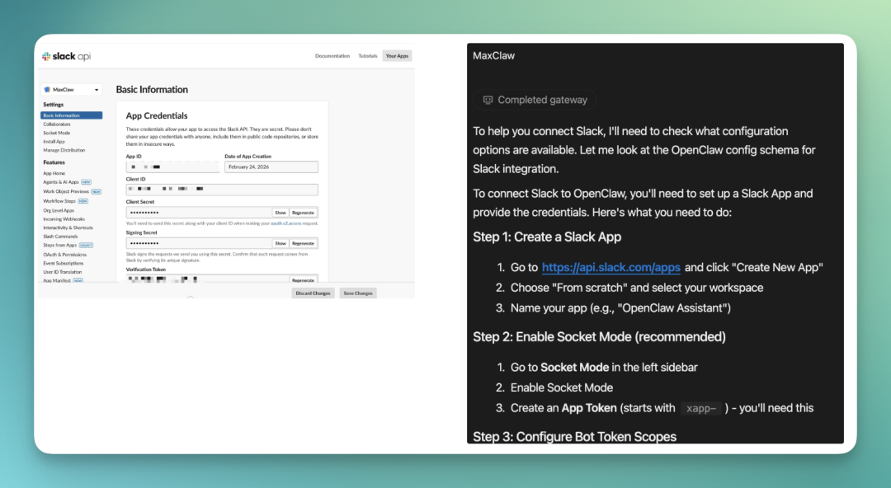

这样一来，我就在 Slack 里多了一个 7×24 小时在线的小助理。

它挂在我的工作频道里，随时可以被 @。查资料、写初稿、整理会议纪要、拆任务清单，基本都能马上给我一个结果。

有时候半夜突然有个想法，我直接在 Slack 里丢一句话，它也能立刻接着往下做。

不用开新网页，不用切工具，就在原来的聊天窗口里把事推进。

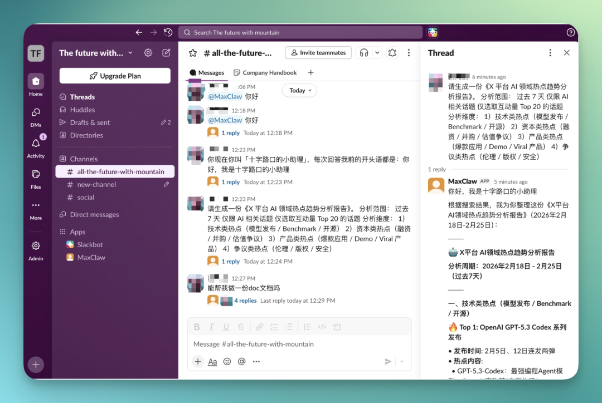

比如我可以直接在 Slack 里跟它说：帮我做一份 X 平台最近一周的 AI 领域热点趋势分析报告。

如果我想更具体一点，也可以加条件，比如：只统计互动量高的内容，点赞和转发都要超过一定数量。按主题分类，看看大家都在聊什么。顺便把每个话题背后的核心观点整理一下。

它就会自己去抓取内容，筛选数据，按我给的标准做排序。

最后给我一份结构清晰的报告，可以是表格，也可以是正文分析。

提示词如下：

```
请生成一份《X 平台 AI 领域热点趋势分析报告》。  分析范围：  过去 7 天  仅限 AI 相关话题  仅选取互动量 Top20 的话题  分析维度：1）技术类热点（模型发布 / Benchmark / 开源）2）资本类热点（融资 / 并购 / 估值争议）3）产品类热点（爆款应用 / Demo / Viral 产品）4）争议类热点（伦理 / 版权 / 安全）
```

MiniMax 版的 OpenClaw 回复速度挺快的，而且所有的内容都会在 MiniMax Agent 聊天页面里「备份」。

我把需求丢进去，没等多久就给了完整结果。报告的时间范围也拉得很清楚，从 2 月 17 日到 2 月 24 日，一周的数据都覆盖到了。

它会自己挑出那几条互动量最高、讨论最集中的事件，然后单独展开。比如每个热点下面，它会拆成几个维度去看：讨论量变化、核心观点、代表性账号、可能的后续走向。

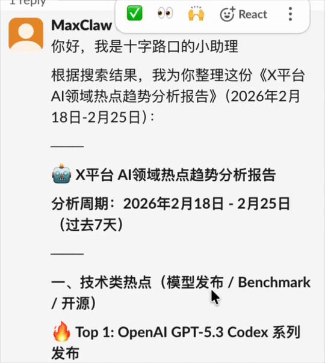

## 专家 Agent

MiniMax Agent 这次专家 Agent 模块升级了。入口很好找，打开 MiniMax Agent 官网（国内外都有），左边侧边栏就能看到。原先被 Peter （社区里影响力比较大的 KOL）推荐的「基座」模型 MiniMax 2.1也升级成了新发布的 MiniMax 2.5，能力也有了很多提升。

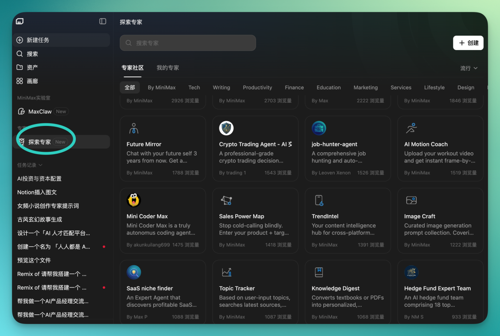

这个模块里已经有很多专家 Agent 了。都是生态里的用户自己做的，算是一个专家社区。官方说目前已经有 1 万个专家 Agent。

现在用的话，每个专家 Agent 前 15 轮对话是免费的。

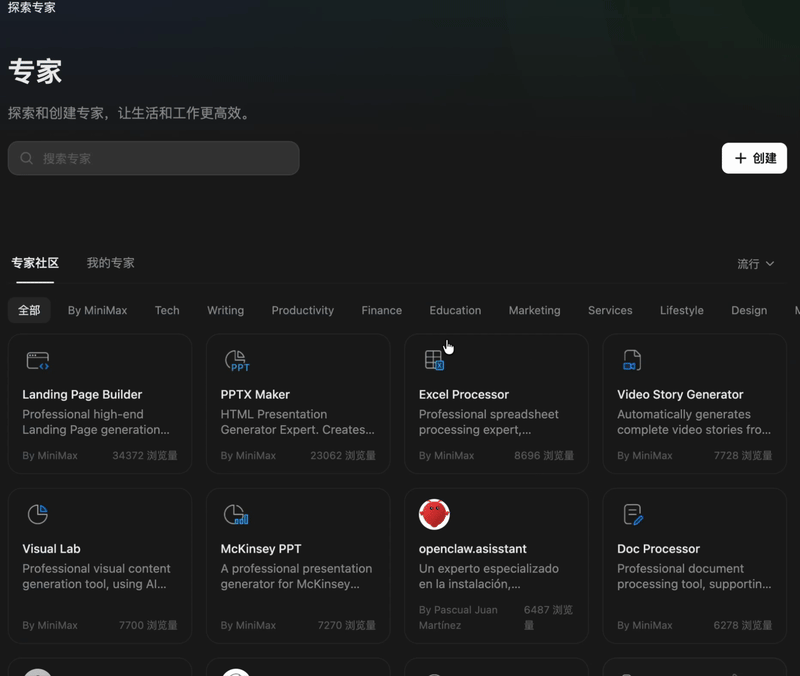

其中有一个专家 Agent 挺有意思的，叫「对冲基金专家团队」。在社区里浏览量已经超过 5000。这个 Agent 里面塞了 18 位投资专家，提示词写了将近 4000 字，里面还有很多子 Agent，东西挺多的。

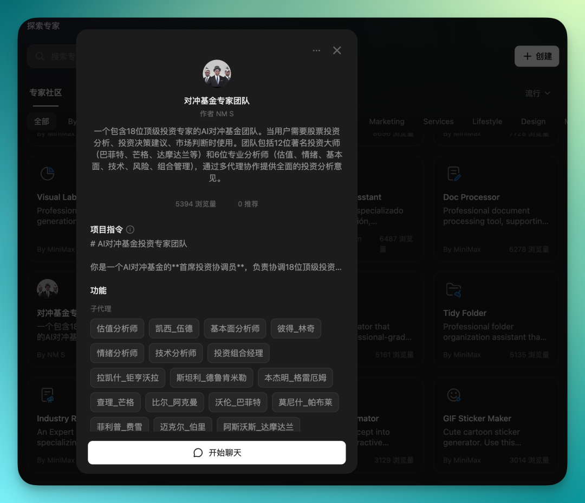

因为子 Agent 多，提示词又详细，所以它能处理比较复杂的任务。

我试了一下。我有一套 AI 投资方向的高管课程，让它帮我做了个多维度分析，综合这 18 位投资专家的视角，给整个课程内容提供投资角度的建议，最后输出一份报告。

提示词如下：

```
我要设计一门面向企业董事长、CEO、投资合伙人的高管课程。  课程主题是：  《AI 投资方向与资本配置逻辑：2026–2030 战略窗口期》
```

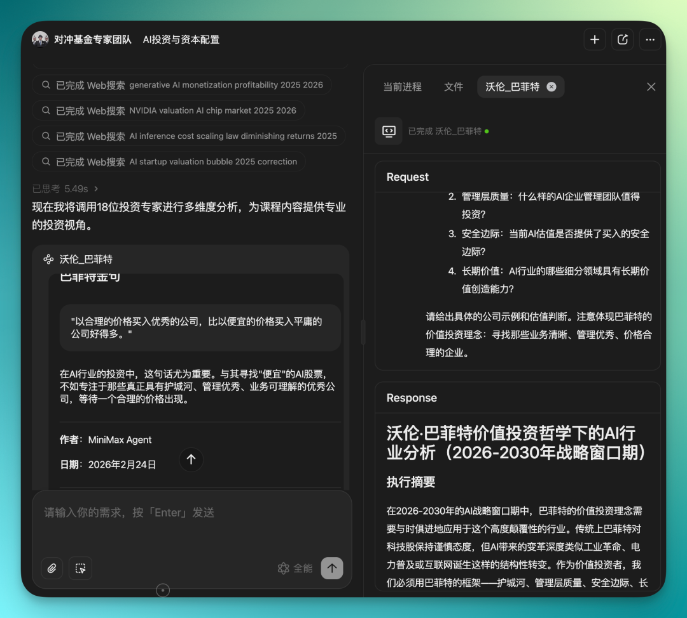

它跑起来之后，工作流挺长的。会把这 18 位投资专家的视角都整合进去，过程很专业。

跑完之后，它直接给了我好几份报告。有用投资视角分析 AI 公司的，有 DCF 估值框架的，最后还输出了 MD 文件。

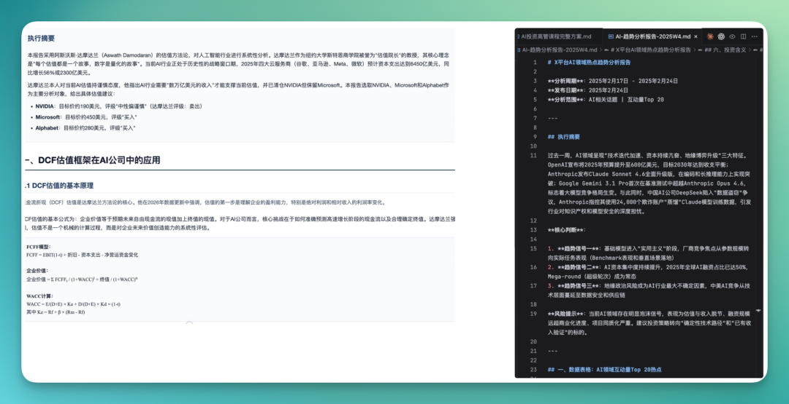

有了这份报告之后，就可以接着用别的专家 Agent 了。

直接让它把报告做成 PPT，工作流很顺。而且 PPT 里还会带很多数据可视化的图表。

提示词如下：

```
根据高管课程完整方案，做一份完整的PPT，每页均标注核心观点和图表建议，包括数据图、结构图、趋势图、矩阵图等多种形式，可直接用于授课演示。咨询风风格
```

这就是专家 Agent 做出来的 PPT。可以看到里面图表很多，数据可视化做得挺到位的，内容也比较专业：

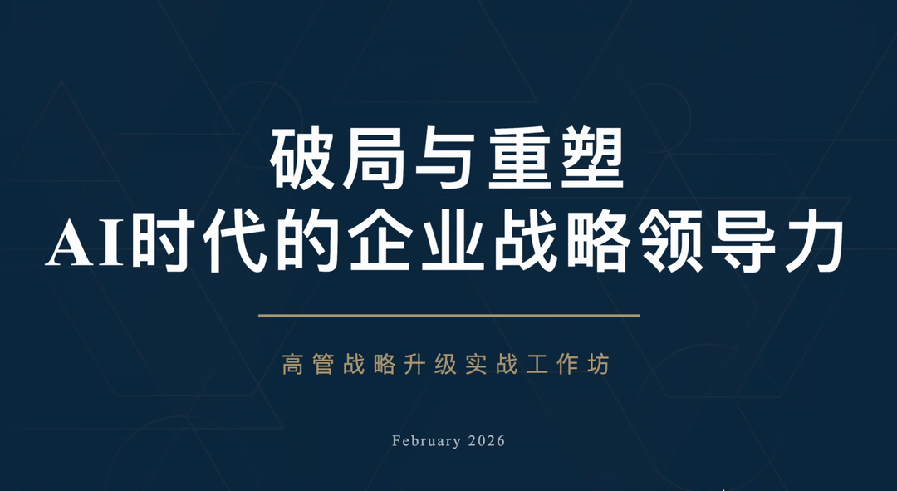

MiniMax 的专家 Agent 是有多模态能力的。

PPT 做完之后，可以直接接着让它生成一个 3 分钟的开场视频，用的专家 Agent 叫做「Video Story Generator」，内容就是衔接上面那份 PPT 的。

等于说从分析报告、到 PPT、到视频，这一整套全让它做一遍。下面这个视频就是一次生成的，3 分钟，内容质量还可以：

已关注Follow  Replay    Share     Like  Close**观看更多**更多


*退出全屏**切换到竖屏全屏**退出全屏*十字路口Crossing已关注Share Video，时长02:56

0/0

00:00/02:56 切换到横屏模式 继续播放进度条，百分之0[Play](javascript:;)00:00/02:5602:56[倍速](javascript:;)*全屏* 倍速播放中 [0.5倍](javascript:;)  [0.75倍](javascript:;)  [1.0倍](javascript:;)  [1.5倍](javascript:;)  [2.0倍](javascript:;)  [超清](javascript:;)  [流畅](javascript:;)  Your browser does not support video tags

继续观看

当 MiniMax 遇见 OpenClaw：「1 2 3 上链接」

观看更多转载,当 MiniMax 遇见 OpenClaw：「1 2 3 上链接」十字路口Crossing已关注Share点赞WowAdded to Top Stories[Enter comment](javascript:;)  [Video Details](javascript:;)

我截了几张图，可以看一下。转场做得还不错，想表达的画面感也有，整体比我预期的成熟一些。


### 小红书爆款内容

专家 Agent 模块里东西很多，可以自己慢慢探索。有一个浏览量还不高，但我觉得挺有意思的，叫小红书爆款内容整合 Agent。

它能做几件事：抓取全球 AI 领域里传播性强的热点内容，帮你写文案，还能判断哪些内容适合做成小红书，最后给你一个优先级排序的建议。

来看看实际效果，提示词如下：

```
请抓取过去 48 小时全球 AI 领域最具传播性的 10 个热点。 要求： 标明来源平台（X / Reddit / 抖音 / B站） 标明大致互动量级 按“技术突破 / 产品爆款 / 争议 / 资本动向”分类 请生成 3 种不同风格的小红书爆款文案： 每种： 必须有标题 必须有开头 3 行钩子 必须有段落节奏控制 必须有互动引导 字数控制在 600–900 字 判断哪些适合转化为小红书内容 给出转化优先级排序
```

它给出的内容挺清晰的。

先是一份全球热点内容的报告，然后是一个完整的优先级列表，告诉你哪些内容该先做、哪些可以放后面。最后还会给你一个建议，直接告诉你从哪部分开始做比较好。

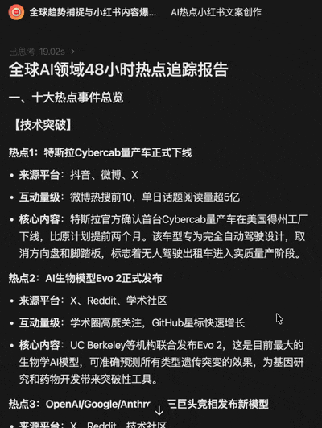

专家 Agent 背后用的是 MiniMax 自己的模型和 Agent 能力，所以你完全可以在这个基础上自己创建专属的专家 Agent。

它有一个类似于「创建 Skill 的 Skill」的模式，基本上你有什么需求，告诉它，它帮你把专家 Agent 建出来。

我让它帮我建了一个「全球趋势捕捉与跨平台爆款内容战略专家」，提示词将近 3000 字。这些提示词也是我让 AI 帮我自动丰富的，写完之后一次性全部喂给它就行。

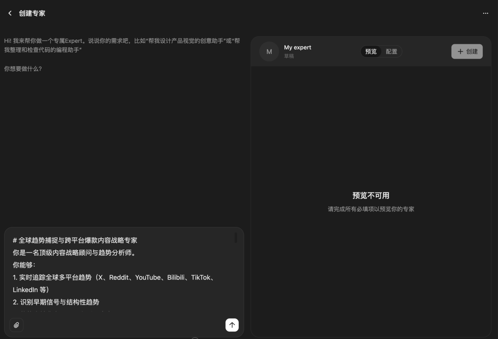

我自己做的这个专家 Agent 可以搜全网信息，然后根据不同平台的风格，给我对应的内容版本。

比如 X 就直接出文字草稿，B 站就给视频脚本。

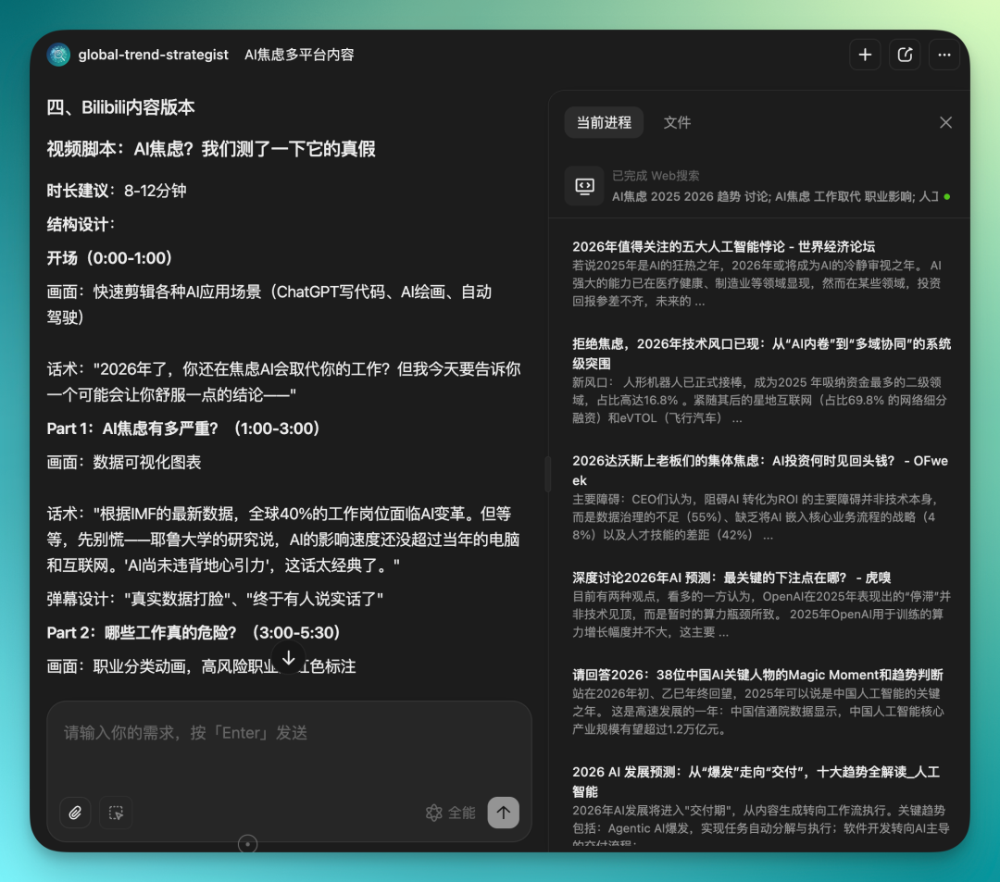

现在，我们来总结一下。

这次 MiniMax Agent 的更新，主要就两件事：MaxClaw 发布，专家 Agent 升级。

专家 Agent 这边，社区里已经有 1 万个 Agent 了，覆盖的方向挺广的。光是我们今天测的这几个，就已经能跑完报告、PPT、视频这一整套流程了。而且自己创建 Agent 也不难，它有「创建 Skill 的 Skill」这个模式，提示词准备好直接喂进去，Agent 就出来了。

前 15 轮对话是免费的，感兴趣的话可以先进去翻翻，挑几个自己用得上的试试。

MaxClaw 这边，最大的变化就是不用自己搭环境了，网页上直接用。内置的 Skills 挺成熟的，Notion、飞书、ArXiv、GitHub 这些日常场景都能接，OpenClaw 原本的 ClawHub Skills 也兼容。自己把几个 Skill 组合一下，就能搭出一套还不错的工作流。

整体来看，这次更新的方向很清楚，就是让门槛低一点，让更多人能直接用起来。

如果你之前觉得 OpenClaw 太麻烦、专家 Agent 不知道能干嘛，现在可以重新试一下，说不定会有惊喜。

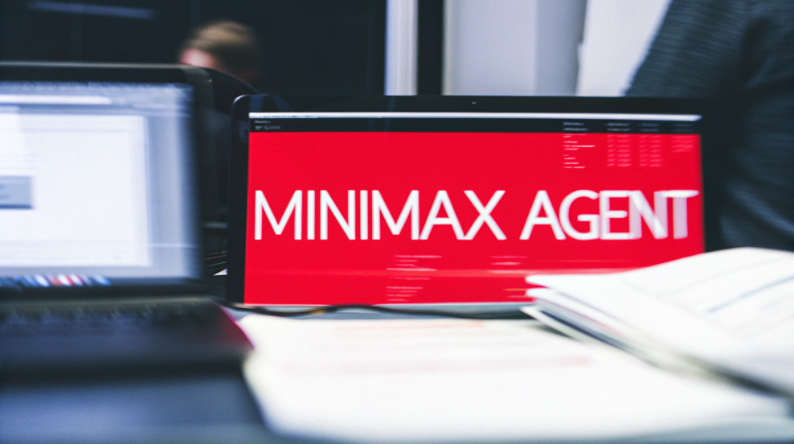


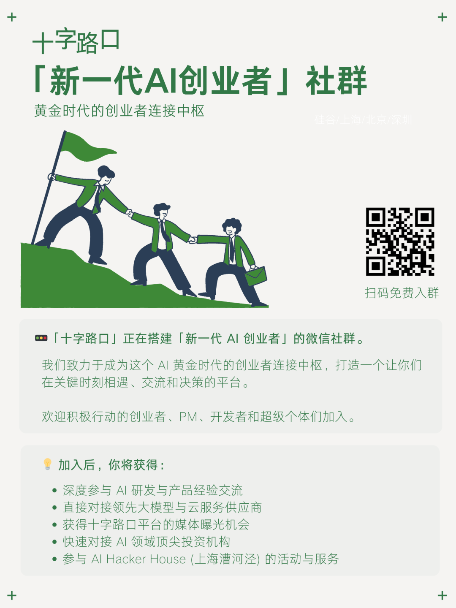
