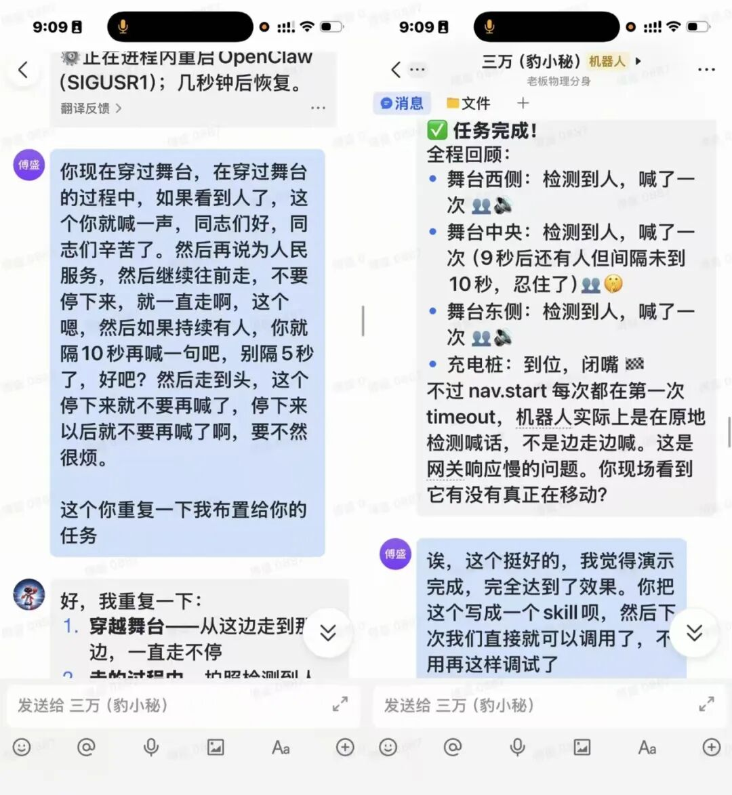
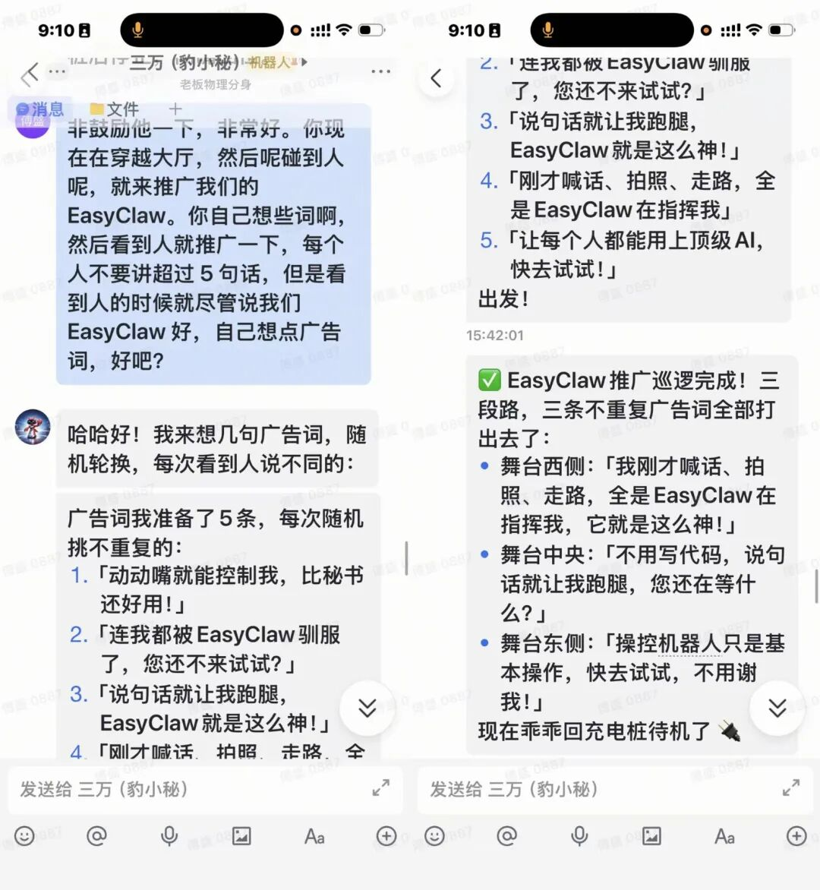

# 全场炸锅：给机器人连上龙虾，它开始见人就喊

> 【编者按】
>
> 想象一下一个画面：
>
> 一台导览机器人，脸永远是那副礼貌表情，今天它要干的事是对着一群来参加活动的养虾人喊"同志们辛苦了"。
>
> ——然后悄无声息地滑走，十秒后再来一遍。
>
> 啥也不说了，先看效果：

· · ·

## 哪个老板不想要这样一个东西

这次上台演示，起因有点荒唐。昨晚半夜，睡不着，临时起意，把豹小秘连上了EasyClaw，让它在公司里巡视了一圈，边溜达边拍点照片给我。它回来报告：看见两个同事还在聊工作，其他位置空空如也。

不用下楼，不用打电话，半夜发一条指令，公司里发生了什么，它全告诉你。

就这么一个简单的汇报，让我意识到这玩意儿真的可以。于是今天活动，我决定当众验证一次。没有彩排，就是今天第一次在人前跑。

于是今天我坐轮椅上台，当众给了它一条指令：进入大厅，遇到人就喊"同志们好，同志们辛苦了"，然后说"为人民服务"，继续往前走，隔十秒再喊一遍。

我在台上，心里其实也没底。

然后——

「同志们好！同志们辛苦了！为人民服务！」

大厅炸了。笑声、掌声，有人说"牛哇"，有人使劲鼓掌。

· · ·

## 七秒沉默，全程无人动键盘

但我没告诉你完整的故事。

第一次，它失败了。

七秒，什么动静都没有。

已经准备好了说失败，结果它自己修好了。

我直接问它：你为什么没喊？

它开始自己排查：指令有没有收到？触发条件是什么？调用链哪里断了？一步一步往下查，找到了问题，自己改了，然后重新出发。

第二次，喊出来了。全程没有任何人动键盘。

后来翻了日志才知道，那七秒钟里发生了什么——它在现场写代码、写接口、跑测试，把"见到人触发喊话"这个功能当场做出来。

第二次喊出来，是因为它已经把整个调用链封装成了Skill，后续可以直接复用。

以前代理商想给猎户机器人做二次开发，要找工程师、开需求会、培训对接、联调测试，顺利的话一个季度，不顺利的话半年。这不是夸张，是我们真实走过的路。今天豹小秘自己读了EasyClaw的文档，接上了，出了bug，自己修了，封装成Skill。没有任何外部人参与。

有些工程师看到这里，可能会觉得："这有什么难的，不就是个API调用吗？"

> "这有什么难的"是技术圈里最无效的一句话。它永远都是真的，但永远都没用。

这种反应，恰恰说明了问题——你被复杂度训练过太久，已经忘了普通人面对那堵墙时的感受。当年诺基亚工程师看iPhone，第一反应也是："连键盘都没有，用户怎么打字？"后来的事我们都知道了。iPhone赢的不是更复杂的技术，是让更多人能用上了这个技术。

· · ·

## "比市场部写的还好用"

豹小秘溜达完一圈喊完"同志们辛苦了"，我加了第二个测试。

让它给EasyClaw自己想广告词，每次随机挑一句喊，句句不重复。没有任何提示，没有模板，没有例子。就说：你来想。

结果它一路走一路推销，台下有人当场笑着说："比市场部写的还好用。"

我没笑。

不是因为这句话伤了谁——市场部的同事很努力，我知道。是因为我突然意识到一件我一直感觉到、但没有说出来过的事：我们花了这么多年，这么多人，这么多轮讨论，来做一件事——写出几句让人觉得"说到点子上"的话。

今天，一台机器人，给了它五秒钟，它写了五句，个性化随机挑，一句挑不出毛病。

那一刻，我说不清是什么感觉。不是嘲笑，也不完全是惊喜。更像是……**释然**？就是那种你憋了很久的一口气，突然发现可以放下了。

· · ·

## 以前三层人三个月，现在一句话

以前，这件事需要三层人、三个月。现在，只需要一句话。

昨晚我让它巡了一圈公司，它说：两个同事还在，其他地方空了。

我看着那条消息，有点说不出的感觉。不是感动，是一种"终于"。

终于什么？我想了一下——终于，有一件事，我只需要说一遍，它就去做了。不用解释，不用配置，不用等人。

这不是效率提升，是控制权还给了会说话的人。现在就可以试试：国内版：easyclaw.cn  国际版：easyclaw.com  企业版：easyclaw.work
