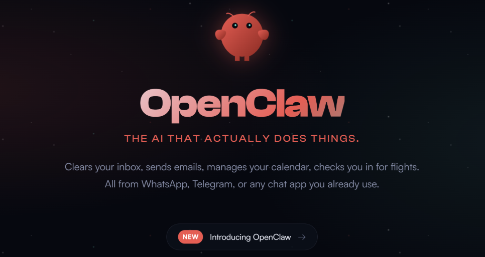
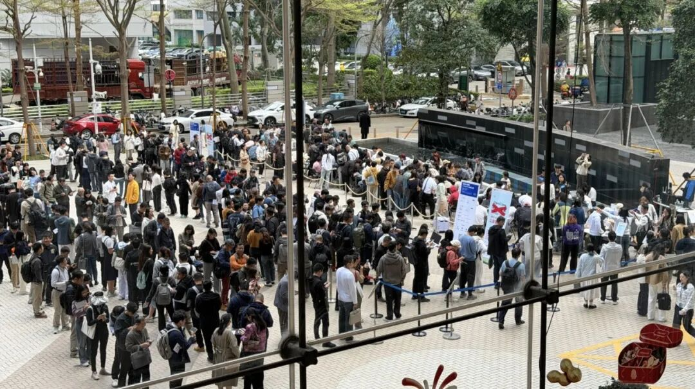
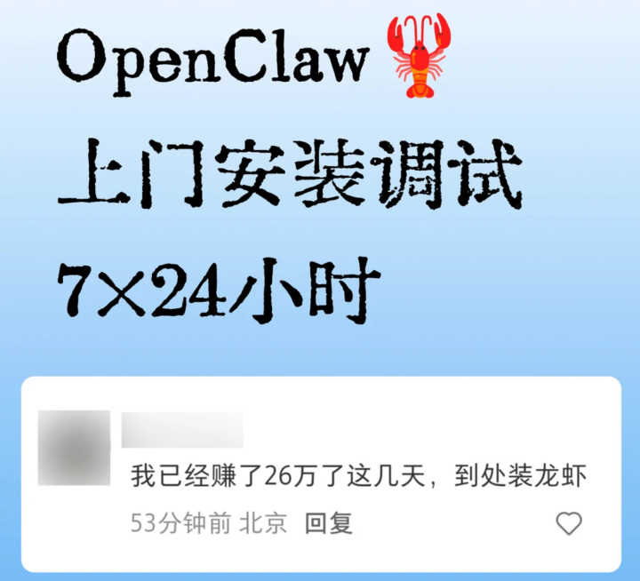
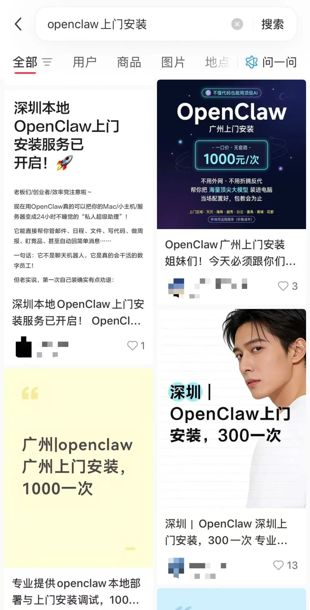
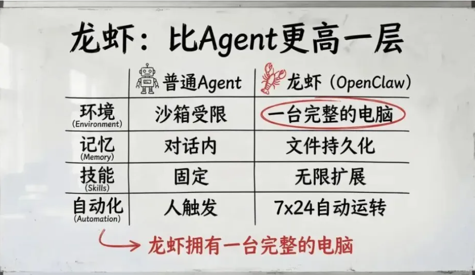

# 公务员“养龙虾”冲上热搜，OpenClaw爆火，有人称靠上门安装赚26万

近日，开源AI智能体OpenClaw持续出圈，“养龙虾”成为科技圈的热门话题。

这个龙虾不是餐桌上的海鲜，而是OpenClaw的中文昵称，因图标形似小龙虾得名。

和DeepSeek、ChatGPT零门槛上手不同，要使用OpenClaw有点门槛。

此前，腾讯云Lighthouse的工程师为用户免费提供安装教学OpenClaw的一站式服务。近千人在腾讯楼下排队的场面，刷屏社交媒体。

近千名开发者和AI爱好者齐聚腾讯（图源：南方+）

有程序员发现了商机，通过付费安装OpenClaw服务，最先赚到了钱。

在一些平台搜索“龙虾/OpenClaw上门安装”，**会发现这项服务价格从300元到1000元不等，500元/次为最常见的价格**，服务内容涵盖本地部署、调试运行和基础使用指导。“远程安装”价格为50元～100元/次。**有网友甚至宣称，几天内靠这项服务赚取26万元。**

**“龙虾”到底能够干什么？**

OpenClaw（前身名为 Clawdbot/Moltbot）是一个开源的、本地优先 (Local-First) 的AI Agent框架。**不同于只能在网页里聊天的各种AI应用，OpenClaw是一个能接管用户键鼠权限的超级助理。**OpenClaw能够运行在用户的终端里，直接调用系统 API 来完成复杂任务。

（图源：南方+）

根据用户的分享可以看出，在实际使用中OpenClaw的能力可以覆盖工作和生活多个场景。

工作上，OpenClaw能化身高效办公助手：接入邮箱后，可自动整理未读邮件并分类标注优先级，每天定时推送处理提醒，告别几百封未读邮件的焦虑；能同步不同平台的日程表，自动检查近期会议安排，临近时间实时提醒，再也不用担心错过重要会议；还能对接各类文档工具，实现PDF、Word、PPT等文件快速转换为Markdown格式，论文、资料秒转后可直接喂给AI做摘要，大幅提升资料处理效率。甚至能打通Obsidian和Notion等知识库工具，用户只需发一句话、一张图，就能实现内容自动归档、打标签、排版，让知识管理从手动维护的繁琐操作，变成“一句话指令，全流程自动化”。

此前猎豹移动CEO傅盛就通过直播，分享了利用“龙虾”实现工作的案例：傅盛表示，今年春节因滑雪摔伤腿后，自己每天只能躺在床上无法正常工作，恰逢“龙虾”的出现，就开启了“养龙虾”的探索之路。在“养龙虾”14天后，“龙虾”逐步从还不懂查通讯录的“小白”智能体“养”成了一支包含8个Agent的“团队”，更重要的是8个“团队”不仅能够7×24小时自动工作，而且还能够自我迭代。

**公务员养起“政务龙虾”**

3月8日，#公务员养上政务龙虾了#冲上微博热搜。

据南方+报道，“龙虾”目前已经在深圳福田区两个岗位上正式“上班”。

**——民生诉求“分析员”**

以前，处理老百姓的投诉和建议，全靠人工一条条看、一个个分类，耗时又容易漏掉重点。现在，“政务龙虾”能自动把海量的民意诉求“吃”进去，快速吐出一份“体检报告”。它能精准识别出大家最关心什么、哪里问题最多，甚至能提前预判潜在的风险。

**——卫生许可“辅导员”**

办公共场所卫生许可证，最怕材料带不齐、怕表格填不对、怕跑断腿还办不成。“政务小龙虾”能用大白话跟你聊天，问你：“你是开理发店还是开健身房？”然后根据你的回答，主动告诉你需要准备什么材料，甚至能帮你预审表格。审批效率提升2-3倍，既分流了窗口咨询压力，也让窗口人员聚焦复杂业务办理。

福田区政务服务和数据管理局相关负责人介绍，AI数智员工2.0由福田辖区企业完全自主研发，拥有完全知识产权。这位特殊的“同事”，不喝咖啡、不用休假，能实现24小时在线帮老百姓办事。

**SFC**

内容综合自丨南方+、广州日报、南方都市报

编辑｜黎雨桐 见习编辑林芊蔚

**21君荐读**

[杭州土拍开年王炸，溢价率51%，出价109轮](https://mp.weixin.qq.com/s?__biz=MjI3Njc0NTk4MQ==&mid=2650569864&idx=1&sn=0e7002b1df6228b8e5607e45d216774d&scene=21#wechat_redirect)

[原材料一周涨价40%，仓库爆仓，周边大堵车！直击中东战火下的塑料市场](https://mp.weixin.qq.com/s?__biz=MjI3Njc0NTk4MQ==&mid=2650569839&idx=1&sn=2ade179a7d900713116d35f1ee45251e&scene=21#wechat_redirect)

