# 林俊旸发文告别阿里：我只能做这么多/黄仁勋：龙虾是史上最重要软件/ChatGPT成人模式再推迟｜Hunt Good 周报

欢迎收看最新一期的 Hunt Good 周报！在本期内容你会看到：7 条新鲜资讯
3 个有用工具
1 个有趣案例
3 个鲜明观点Hunt for News｜先进头条👋 林俊旸朋友圈发文告别千问：我做到了为集团好林俊旸在 X 上的一条告别贴文，成了这周国内外媒体最关注的热点之一。
[3 月 4 日凌晨，](https://mp.weixin.qq.com/s?__biz=MjM5MjAyNDUyMA==&mid=2651082793&idx=1&sn=d9ab7af3e71f948f81e3197b0b4b9245&scene=21#wechat_redirect)[林俊旸在社交媒体公开宣布离职意向](https://mp.weixin.qq.com/s?__biz=MjM5MjAyNDUyMA==&mid=2651082793&idx=1&sn=d9ab7af3e71f948f81e3197b0b4b9245&scene=21#wechat_redirect)，这一举动引发了阿里内部的紧急讨论。3 月 5 日，阿里巴巴集团 CEO 吴泳铭正式批准了 Qwen（通义千问）团队负责人林俊旸的辞职申请。作为阿里最年轻的 P10 级高管之一，林俊旸在执掌 Qwen 的 7 年间，成功将其打造为全球最具影响力的开源模型系列之一。他的离职，一时间让互联网上众说纷纭，[据 APPSO 从知情人士处了解到](https://mp.weixin.qq.com/s?__biz=MjM5MjAyNDUyMA==&mid=2651082917&idx=1&sn=8a3e7db630c68bca6a40f84a720e02e3&scene=21#wechat_redirect)，所谓的 KPI 考核不达标，阿里对开源态度转变的说法，都是空穴来风。周六凌晨，林俊旸在朋友圈发文告别千问，他提到不管别人怎么说他，他内心觉得自己做到了为千问团队，为阿里云，为集团好，虽然也有很多没有做到位。晚点在本周五也梳理了一遍林俊旸的这场离职风波，里面提到阿里管理层对林俊旸「未经沟通即公开宣布离职」的行为，是对公司组织制度的挑战。据晚点了解，林俊旸发出离职状态时，阿里并未回应他的离职请求。一位阿里人士称，「制度是不能碰的，而他在挑战公司制度。」这里的「制度」是指在阿里，所有人都是公司员工，升和降都由公司决定，如果不满可以正常沟通，但不能没沟通就到社交媒体公开发声，不能开这样的先例。3 月 3 日下午，阿里云 CTO 周靖人向林俊旸传达了重组 Qwen 团队的计划，并将引入原 DeepMind 高级研究员周浩参与管理。面对团队即将从垂直整合转向水平分工的调整，林俊旸情绪激烈，并在沟通后不久于团队群内表示「无颜再带领大家」。在 3 月 4 日下午召开的 Qwen 全员会上，阿里高层明确强调，集团将继续支持 AI 战略，但同时指出「不能神化个人」，必须维护公司组织制度。目前，阿里已明确表示将继续坚持开源模型策略，由吴泳铭、周靖人及集团 CTO 吴泽明共同协调资源，以保障基础模型建设的稳定性。🔗 相关阅读：[一夜之间，全球 AI 圈都在转发这条告别推文](https://mp.weixin.qq.com/s?__biz=MjM5MjAyNDUyMA==&mid=2651082793&idx=1&sn=d9ab7af3e71f948f81e3197b0b4b9245&scene=21#wechat_redirect)[刚刚，阿里批准林俊旸辞职：昨天还在挽留，否认停止开源](https://mp.weixin.qq.com/s?__biz=MjM5MjAyNDUyMA==&mid=2651082917&idx=1&sn=8a3e7db630c68bca6a40f84a720e02e3&scene=21#wechat_redirect)[林俊旸离开的 48 小时：一条朋友圈、一个小模型、和一个万亿美金的假设](https://mp.weixin.qq.com/s?__biz=MjM5MjAyNDUyMA==&mid=2651082958&idx=1&sn=ad21b3bd045930e3ebbc78b963820320&scene=21#wechat_redirect)🈲 奥特曼再次推迟 ChatGPT 成人模式上线OpenAI 本周五宣布，将再次推迟 ChatGPT 「成人模式」的发布计划。这项功能曾由奥特曼在去年 10 月首次预告，主要是在通过身份验证系统后，允许用户生成包含色情内容等在内的敏感素材。这是该功能第二次遭遇延期。此前 OpenAI 曾承诺在今年第一季度推出该模式，并投入大量精力优化年龄估算系统。根据爆料人的信息，OpenAI 发言人在声明中表示，为了响应更多用户对提升模型智力、个性化定制及「更具主动性交互体验」的需求，公司决定暂时将有限的研发资源向这些高优先级项目倾斜。尽管再次「跳票」，OpenAI 仍坚持其「像对待成年人一样对待成年人」的原则，并强调推迟是为了完善年龄预测算法，以确保在开放更广泛权限的同时，能为未成年用户提供更严密的保护。目前，官方尚未给出该功能的具体上线日期。🔗 https://www.axios.com/2026/03/06/openai-delays-chatgpt-adult-mode🎬 好莱坞巨星潜伏四年，把一家 AI 公司卖给了 NetflixNetflix 周五上午宣布，正式收购由好莱坞知名影星本·阿弗莱克（Ben Affleck）在 2022 年创立的 AI 影视技术公司 InterPositive。作为这笔交易的一环，阿弗莱克将以高级顾问的身份跨界加入 Netflix，不过双方暂未披露具体的收购金额。在这个「AI 演员」和虚拟生成技术满天飞的时代，最有趣的一点是，InterPositive 压根没打算用 AI 来合成表演或取代真人演员。他们把大模型用在了后期制作上，专门帮幕后团队处理剪辑连贯性问题、修复穿帮镜头、微调光线或是进行背景替换。这次收购与 Netflix 拥抱生成式 AI 的大方向高度契合。在此之前，Netflix 已经在部分自制剧集的特效制作中吃到了 AI 的甜头，并保证已经「做好了充分利用 AI 持续进步的准备」。🔗 https://techcrunch.com/2026/03/05/netflix-buys-ben-afflecks-ai-filmmaking-company-interpositive/💰 OpenAI 年化收入达 250 亿美元，Anthropic 紧随其后据《The Information》报道，OpenAI 的年化营收在上月已突破 250 亿美元，这一数字较去年底的 214 亿美元增长了 17%。与此同时，其竞争对手 Anthropic 也在快速追赶，年化营收最近突破 190 亿美元，为去年底的两倍。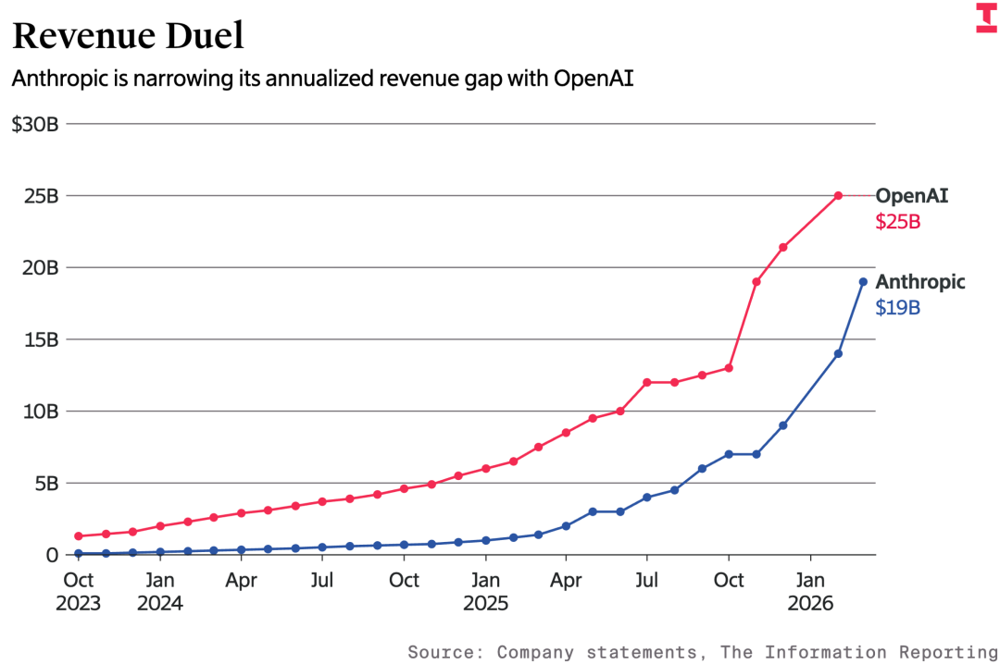OpenAI 的营收增长主要得益于其旗舰产品 ChatGPT，同时其面向商业客户的新业务和广告合作潜力也备受关注。报道称，OpenAI 正在与广告技术公司 The Trade Desk 探讨合作计划，以进一步扩大广告客户群。此外，其编程助手 Codex 的每周活跃用户自年初以来已增长至 200 万。而 Anthropic 的 Claude Code 产品也在近期快速增长，对其营收提升起到了显著作用。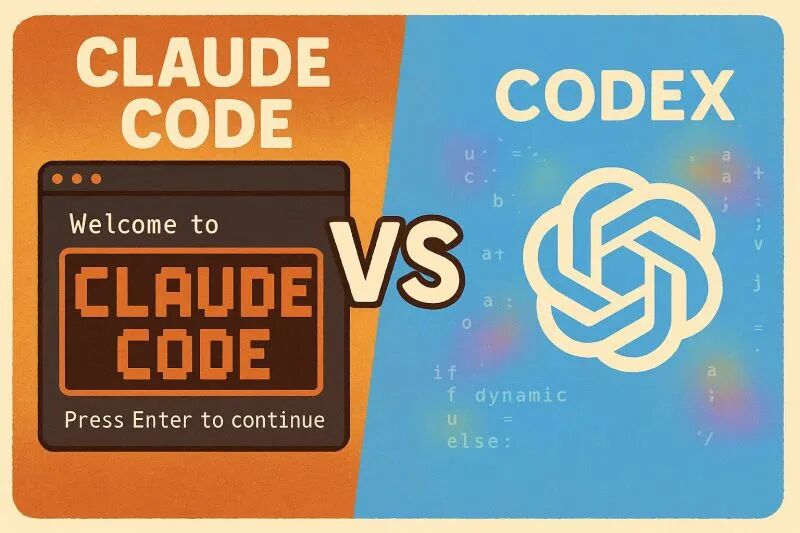值得注意的是，有消息称，OpenAI 已选定律师事务所为其 IPO 做准备，最快可能在今年上市。不过，巨额的技术开发成本仍是两家公司面临的挑战。OpenAI 预计到 2030 年将花费 6650 亿美元用于服务器和相关技术投入。尽管如此，OpenAI 仍将 2030 年的营收目标设定为 2840 亿美元，而 Anthropic 则预计能在 2028 年实现正向现金流。🔗 https://www.theinformation.com/articles/openai-tops-25-billion-annualized-revenue-anthropic-narrows-gap💰 用 AI 报税，ChatGPT、Claude 四大模型平均算错两千美元前几天，外媒 NYT 联合美国税务服务机构 TaxSlayer，使用 8 个虚构的税务场景，对 Google 的 Gemini、OpenAI 的 ChatGPT、Anthropic 的 Claude 以及 xAI 的 Grok 这四款当红 AI 聊天机器人进行了所得税申报测试。结果显示，这四大模型全部陷入苦战，计算出的应缴税款或退税金额与实际数字平均相差超过 2000 美元。
导致这一尴尬局面的核心在于 LLM 的底层运作机制。斯坦福大学以人为本 AI 研究所（HAI）的高级研究员 Erik Brynjolfsson 把这种现象称为「税法悖论」。他提到像 TurboTax 这样的传统报税软件，依靠的是严密的「如果-那么」程序逻辑，专为数学精度而生；而大语言模型本质上是预测引擎。它们虽然在阅读和写作等任务上表现得像超人，但在处理大量互相关联且需要严格按顺序更新的税务表格时，却极易产生错误累积。🔗 https://www.nytimes.com/2026/03/05/technology/artificial-intelligence-taxes-tax-refund.html😂 黄仁勋表示，向 OpenAI 投资 1000 亿美元「不太可能」黄仁勋在旧金山摩根士丹利会议上表示，向 OpenAI 投资 1000 亿美元的计划已经不在讨论范围之内。他还提到，OpenAI 正计划在今年年底上市，这也让大规模投资显得难以实现。英伟达已敲定向 OpenAI 投资 300 亿美元的协议，并将专注于为其提供训练和运行 AI 模型所需的大规模计算能力。黄仁勋补充说，「这可能是我们最后一次有机会投资这样一家意义重大的公司」。去年，英伟达曾表示有意在双方合作中投资高达 1000 亿美元，用于建设至少 10 吉瓦规模的 AI 数据中心。此前他们还对 OpenAI 竞争对手 Anthropic 投资了 100 亿美元，黄仁勋称这可能也是他们的最后一笔重大投资。值得注意的是，Anthropic 正准备 IPO，市场对其股票的需求正在上升。尽管有关于英伟达与 OpenAI 投资关系的紧张传闻，黄仁勋在近期采访中否认了他对 OpenAI 不满的说法，称其为「荒谬」。他高度认可 OpenAI 的工作，并强调其发展对整个行业的重要性。此外，他对未来可能参与 OpenAI 的 IPO 表示出浓厚兴趣。🔗 https://www.businessinsider.com/jensen-huang-openai-investment-not-in-the-cards-100-billion-2026-3🦞 上门安装、还加按摩，OpenClaw 横扫全国作为一款具备主动执行与插件扩展能力的 AI 工具，OpenClaw 仅用百天便超越 Linux，一举登顶 GitHub 基础软件星标历史第一。然而，复杂的环境配置让不少新手望而却步，国内社交平台催生了不少上门收费的代装服务。周五，腾讯深圳总部门前排起长龙——近千名开发者与 AI 爱好者来到腾讯大厦，在腾讯云工程师的协助下，通过腾讯轻量云 Lighthouse 完成了龙虾的安装。「龙虾之父」Peter Steinberger 也在腾讯这波部署活动下面评论「让更多的人接触 AI 是 ❤️。」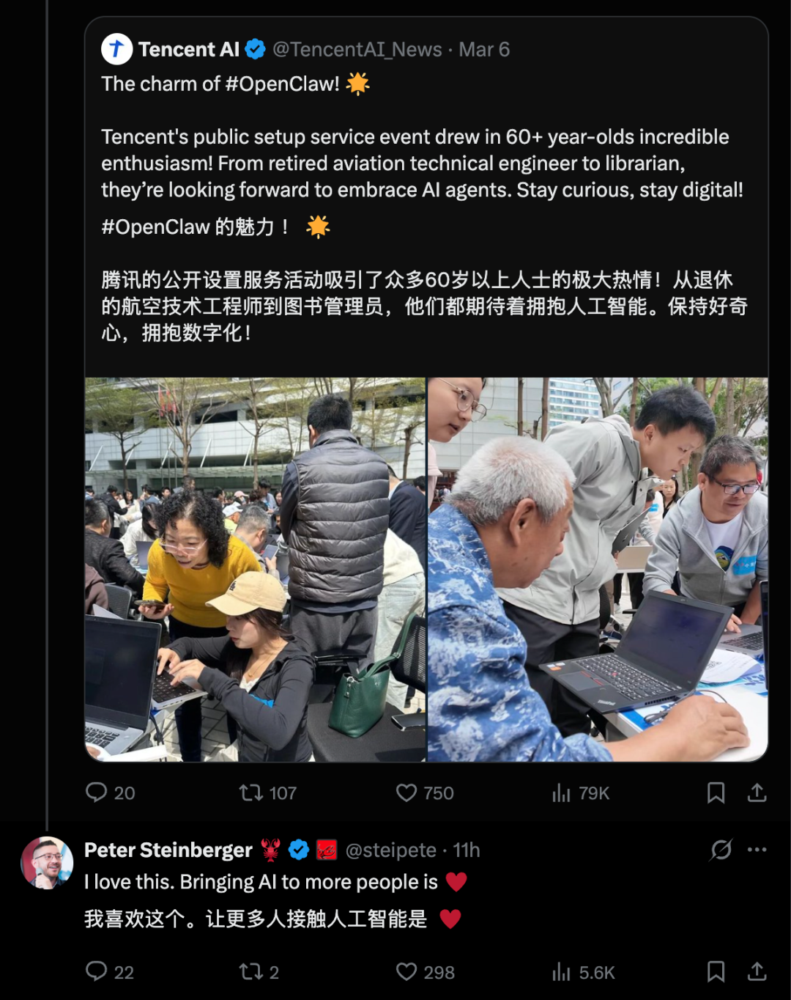The Information 最近也报道了龙虾在国内遍地开花的情况，里面描述了从杭州的 AI 黑客松到北京的开发者聚会，国内创业者正疯狂尝试将 OpenClaw 集成到各类应用中，涵盖了 AI 虚拟相亲、招聘对接以及数字游民日志等脑洞大开的场景。
而这场狂潮还不仅限于软件，更渗透到了硬件制造领域。The Information 提到作为第一批支持 OpenClaw/MCP 控制的硬件品牌制糖工厂，现已完成智能桌面充电产品「小电拼」对 MCP 协议的集成，实现「龙虾」化。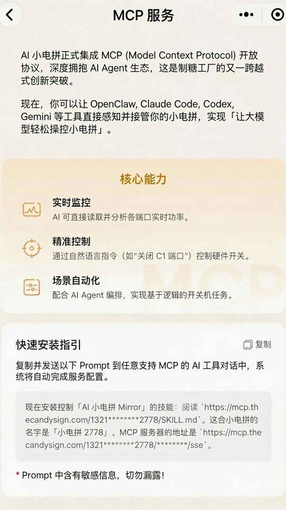图片来自制糖工厂龙虾小电拼OpenClaw、Claude Code、OpenAI Codex 等支持 MCP 的工具，现在可以直接读取并控制小电拼。在制糖工厂的测试中，飞书机器人、Telegram 机器人、基于命令行工具/IDE 环境下的 Claude Code 等代理编程工具，均可实现对「龙虾」化的小电拼进行控制。更有意思的是，文章还提到有一位来自北京大型科技公司的产品经理，为了经营 AI 网红账号，竟背着装有八台二手 MacBook Air 的巨大背包四处奔走，每一台电脑都在 24 小时不停歇地运行着 OpenClaw 代理，负责创作内容并与粉丝互动。OpenClaw 已然成为中国 AI 各个圈层里一股不可逆转的力量，开始重新定义我们个人生产力的未来形态。🔗 https://www.theinformation.com/articles/openclaw-rips-chinas-tech-startup-landscapeHunt for Tools｜先进工具👓 Nearby Glasses：一款开源的智能眼镜提示 AppMeta 近期因其 AI 智能眼镜的隐私问题面临一场新诉讼。据 TechCrunch 报道，一项由瑞典媒体发起的调查揭露，Meta 的肯尼亚外包员工曾审查用户通过智能眼镜录制的内容，其中包括裸体、性行为以及使用洗手间的私密场景。这一消息引发英国信息专员办公室（ICO）的关注，并立刻展开了相关调查。社交媒体上对智能眼镜的隐私问题又开始了沸沸扬扬的讨论。有网友推出了一款名叫「Nearby Glasses」的 Android 应用，可以侦测附近的蓝牙信号，并告诉你有没有智能眼镜出现在周围。它的工作原理并不复杂，通过蓝牙设备的公开识别码，判断佩戴者是否携带了特定品牌的智能设备，比如 Meta 和 Snap 的产品。这款应用的开发者 Yves Jeanrenaud 直接将智能眼镜描述为「无视同意的可怕技术」，他提到开发 Nearby Glasses 的初衷，部分来自 Meta 智能眼镜在隐私侵害上的争议性使用。🔗 https://techcrunch.com/2026/03/02/nearby-glasses-new-app-alerts-you-wearing-smart-glasses-surveillance-meta-snap-bluetooth/🎤 Spectre I：对抗 AI 监听的赛博静音球除了要对抗无处不在的 AI 眼镜，最近还有一家初创公司 Deveillance 发布了一款名为「Spectre I」的便携式桌面设备。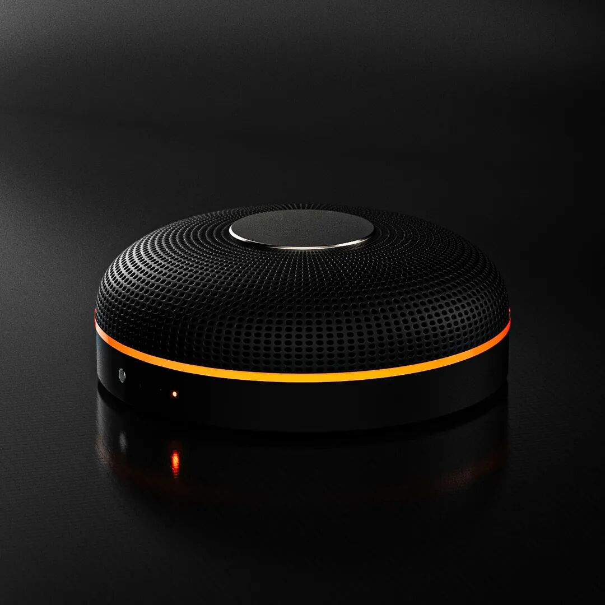这款外观呈球形的小装置，能通过超声波频率发射器与 AI 算法，探测并干扰周围设备的录音功能，从而保护用户的对话隐私。该产品目前还处于研发阶段，预计将于 2026 年下半年上市，定价为 1199 美元。Spectre I 的创始人、哈佛大学毕业生 Aida Baradari 表示，该产品的开发初衷是为日益普及的「始终在线」AI 可穿戴设备（如 AI 项链或眼镜）提供一种防御手段。已关注Follow  Replay    Share     Like  Close**观看更多**更多

*退出全屏**切换到竖屏全屏**退出全屏*APPSO已关注Share Video，时长01:27

0/0

00:00/01:27 切换到横屏模式 继续播放进度条，百分之0[Play](javascript:;)00:00/01:2701:27[倍速](javascript:;)*全屏* 倍速播放中 [0.5倍](javascript:;)  [0.75倍](javascript:;)  [1.0倍](javascript:;)  [1.5倍](javascript:;)  [2.0倍](javascript:;)  [超清](javascript:;)  [流畅](javascript:;)  Your browser does not support video tags

继续观看

林俊旸发文告别阿里：我只能做这么多/黄仁勋：龙虾是史上最重要软件/ChatGPT成人模式再推迟｜Hunt Good 周报

观看更多转载,林俊旸发文告别阿里：我只能做这么多/黄仁勋：龙虾是史上最重要软件/ChatGPT成人模式再推迟｜Hunt Good 周报APPSO已关注Share点赞WowAdded to Top Stories[Enter comment](javascript:;)  [Video Details](javascript:;) 不同于传统的音频干扰器，Baradari 声称 Spectre I 利用 AI 生成特定的抵消信号，旨在欺骗自动语音识别（ASR）系统，从而实现对语音的「模糊化」处理，而非单纯地制造噪音。然而，该产品在社交媒体上引发了巨大的质疑浪潮。多位科技博主和工程师指出，该设备面临严峻的物理挑战。一方面，有效的音频干扰器通常体积巨大，难以做到便携；另一方面，通过射频（RF）探测所有麦克风的技术在工程学上极具难度。电影沙丘里的静音效果知名 YouTube 博主 Benn Jordan 直言，Deveillance 的承诺似乎是在「挑战物理定律」，并怀疑其可能仅是通过扫描蓝牙信号来探测麦克风，而非真正意义上的全类型检测。🔗 https://www.wired.com/story/deveillance-spectre-i/

### GPT-5.4 来了：能操控电脑、写代码、做表格

周五，OpenAI 正式发布最新前沿模型 GPT-5.4，同步推出面向复杂任务的 GPT-5.4 Pro 版本。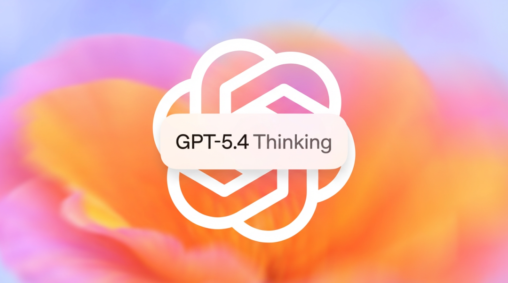🔗 相关阅读：[刚刚，奥特曼砸场发布 GPT-5.4！网友：一句 Hi 烧掉 80 美元](https://mp.weixin.qq.com/s?__biz=MjM5MjAyNDUyMA==&mid=2651082994&idx=1&sn=5628366f6ae7b94dc5c493d2cb56a1d9&scene=21#wechat_redirect)新模型整合了推理、编程与智能体工作流三方面的最新进展，并将 GPT-5.3-Codex 的行业领先编程能力纳入其中，成为 OpenAI 首款具备原生计算机控制能力的通用模型。已关注Follow  Replay    Share     Like  Close**观看更多**更多

*退出全屏**切换到竖屏全屏**退出全屏*APPSO已关注Share Video，时长00:55

0/0

00:00/00:55 切换到横屏模式 继续播放进度条，百分之0[Play](javascript:;)00:00/00:5500:55[倍速](javascript:;)*全屏* 倍速播放中 [0.5倍](javascript:;)  [0.75倍](javascript:;)  [1.0倍](javascript:;)  [1.5倍](javascript:;)  [2.0倍](javascript:;)  [超清](javascript:;)  [流畅](javascript:;)  Your browser does not support video tags

继续观看

林俊旸发文告别阿里：我只能做这么多/黄仁勋：龙虾是史上最重要软件/ChatGPT成人模式再推迟｜Hunt Good 周报

观看更多转载,林俊旸发文告别阿里：我只能做这么多/黄仁勋：龙虾是史上最重要软件/ChatGPT成人模式再推迟｜Hunt Good 周报APPSO已关注Share点赞WowAdded to Top Stories[Enter comment](javascript:;)  [Video Details](javascript:;) 使用 GPT-5.4 自动从网站获取房价信息并导入到表格GPT-5.4 在 Codex 和 API 中具备了**原生的计算机控制能力**：
无需额外插件，模型可通过屏幕截图结合键盘和鼠标指令，直接与网页及软件界面进行交互；
在衡量桌面环境操作能力的 OSWorld-Verified 基准测试中，GPT-5.4 取得了 75.0% 的成绩，不仅大幅超越前代 GPT-5.2 的 47.3%，还超越了 72.4% 的人类基准线；
在浏览器操作基准 WebArena-Verified 上，GPT-5.4 的成功率达到 67.3%，而在 Online-Mind2Web 测试中更以 92.8% 的成功率领跑。在专业知识工作方面：
GPT-5.4 在覆盖 44 种职业的 GDPval 基准测试中达到 83.0% 的胜率或平局率，而 GPT-5.2 仅为 70.9%；
针对投行级电子表格建模任务，GPT-5.4 的得分从 GPT-5.2 的 68.4% 大幅提升至 87.3%；
在演示文稿评估中，68.0% 的人工评测者更青睐 GPT-5.4 的输出结果，理由包括视觉更丰富、美观度更高。其他方面：
在可操控性方面，GPT-5.4 Thinking 在处理复杂查询时会先输出一份「预先计划」，用户可以在模型生成过程中随时介入并调整方向，无需从头开始。该功能目前已在 ChatGPT 网页版和 Android 端上线，iOS 版本即将跟进；
编程能力方面，GPT-5.4 在 SWE-Bench Pro 上的表现与 GPT-5.3-Codex 持平或略有超越，同时延迟更低。Codex 中新增的 /fast 模式可将 token 生成速度提升至 1.5 倍。值得一提的是，全新的「工具查找」机制告别了暴力加载，在保持准确率的同时，将总体 Token 消耗暴降了 47%，省钱又提速。OpenAI 表示，**GPT-5.4 是其迄今为止准确性最高的模型**，单一事实错误率较 GPT-5.2 降低 33%，完整回复的错误率降低 18%。在 ChatGPT 中，GPT-5.4 以「GPT-5.4 Thinking」形态上线，面向 Plus、Team 和 Pro 用户开放，同步替代 GPT-5.2 Thinking。定价方面，API 中 GPT-5.4 的标准输入价格为每百万 token 2.50 美元，输出价格为每百万 token 15 美元；GPT-5.4 Pro 的输入价格为每百万 token 30 美元，输出价格为每百万 token 180 美元，均高于前代 GPT-5.2。Hunt for Fun｜先玩🦞 IronClaw：一个更注重隐私更安全的龙虾Transformer 论文作者之一 Illia Polosukhin 推出了全新开源项目 IronClaw，它是对 OpenClaw 的全面重构。IronClaw 核心理念是「你的 AI 助手应该为你服务，而非对你不利」，它使用 Rust 语言开发，主要为了解决 OpenClaw 近段时间以来，广为诟病的安全漏洞问题。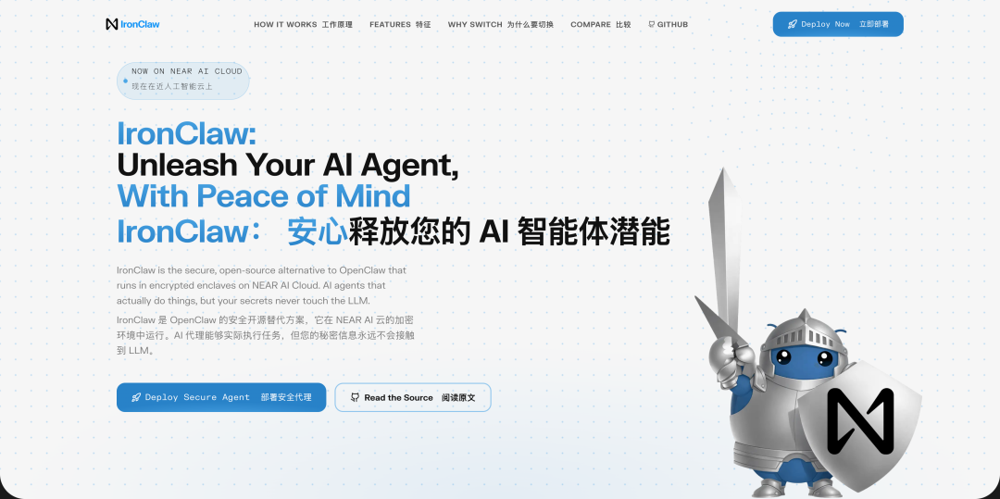项目现已在 GitHub 上开源，提供 macOS、Linux 和 Windows 的安装包。
OpenClaw 因为强大的 AI 智能体功能备受欢迎，但其安全架构漏洞问题被安全专家称为「安全垃圾火灾」。此前爆料有超 25000 个公开实例因暴露用户凭证和敏感数据而饱受攻击。IronClaw 作者指出，OpenClaw 的根本问题在于架构设计，用户的 API 密钥和凭证会直接暴露给大语言模型，造成隐私风险。对此，他决定从零开始，用 Rust 对工具进行完全重构，通过本地数据存储、开放源码设计和多层安全防护，为用户创建一个可信赖的AI工具。目前，IronClaw 已经在 GitHub 上获得了超过 6000 个 stars。体验地址：https://www.ironclaw.com/Hunt for Insight｜先知📈 全球智能危机报告：软件工程师的招聘正在迅速增加据 Citadel Securities 2026 年发布的分析报告显示，尽管 AI 的发展速度备受关注，但其对劳动力市场的实际冲击可能被夸大。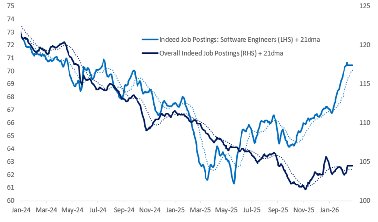数据显示，美国软件工程师的职位招聘同比增长 11%，AI 相关资本支出已占 GDP 的 2%，但 AI 的扩散速度和深度，远未达到大规模取代白领工作的程度。开发者问答平台 Stack Overflow 早在二月初也曾发布过一篇文章，里面提到尽管 AI 被一些人视为开发者工作的终结者，但实际情况可能恰恰相反。AI 不仅没有减少对人类开发者的需求，反而因其带来的技术革命催生了大量新型岗位和新的软件开发需求。Stack Overflow CEO Prashanth Chandrasekar 表示，AI 是继互联网、移动计算和云计算之后的又一次平台变革，将彻底改变开发者的工作方式，并推动整个行业进入一个创新和专业化爆发的时代。这份危机报告还提到，AI 相关产业甚至能为其他行业创造了更多就业机会，例如数据中心建设带动了建筑行业的用工需求。同样从历史来看，技术革命往往重塑工作任务的分工，而非完全淘汰劳动力。就像微软 Office 的出现并没有消灭办公室工作，AI 更可能成为劳动力的补充而非替代品。🔗 https://www.citadelsecurities.com/news-and-insights/2026-global-intelligence-crisis/🏆 黄仁勋：OpenClaw 是有史以来最重要的软件发布黄仁勋最近在公开会议上提到，Agentic AI 已经迎来了全面爆发的拐点。他在会上将当前的 AI 产业生动地比喻为一个「五层蛋糕」，并强调能为超大规模云服务商和前沿实验室带来最丰厚回报的，正是应用层。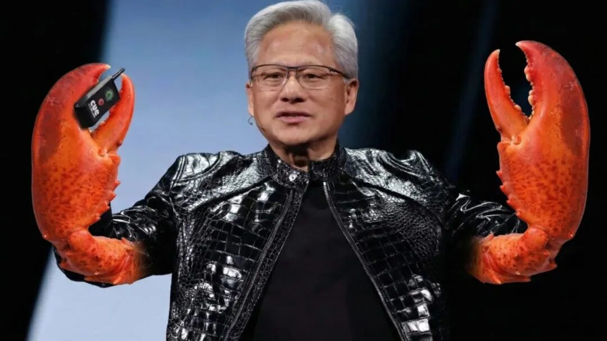其中，他将现象级 AI Agent 工具 OpenClaw 盛赞为「有史以来最重要的软件发布」，认为它已经证明了 AI 在高度个性化环境中，能够完美复刻人类的复杂工作流。
在讨论企业端 AI 需求演变时，黄仁勋也提到 Linux 操作系统花了大约 30 年的时间才达到如今的普及高度，而 OpenClaw 仅仅用了 3 周就实现了超越，一举成为人类历史上下载量最大的开源软件。
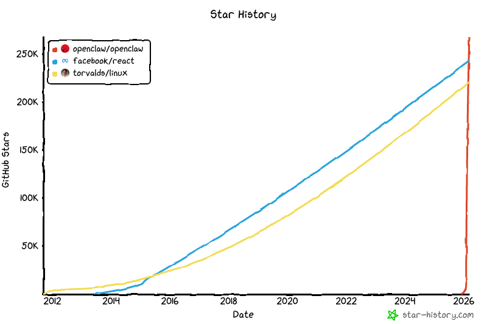黄仁勋透露，由于 AI 智能体频繁执行批量网页搜索、图像生成和复杂数据分析，Token 的消耗量已经暴增了整整 1000 倍。无论现有的硬件集群规模有多大，只要代理型 AI 继续渗透人类工作，算力就将持续受限。针对这一供需失衡，英伟达也亮出了底牌，相比于专注于模型训练的 Hopper 和 Blackwell 架构，下一代 Vera Rubin 架构将结合 ICMS 等平台以及全面升级。🔗 https://wccftech.com/nvidia-ceo-says-openclaw-did-in-3-weeks-what-linux-took-30-years/🧠 最早拥抱 AI 的人开始表示，AI 让我变得好累哈佛商业评论近期发布的一项报告指出，随着 AI 在工作场所的快速普及，过度使用 AI 工具正在让一部分职场人的大脑「过载」。波士顿咨询公司（BCG）与加州大学河滨分校的研究人员为此提出了一个新概念——「大脑烧焦（Brain Fry）」，专门用来形容因过度交互或监督 AI 工具，导致超出人类认知负荷而产生的严重精神疲劳。研究团队对 1488 名美国全职员工的 AI 使用情况进行了深入调查。数据显示，在经常使用 AI 的员工中，有 14% 的人明确表示，自己经历过这种因认知超载带来的精神疲劳。受访者将这种状态描述为大脑里有「嗡嗡」作响的感觉，并伴随着脑雾、注意力涣散、决策迟缓甚至头痛。一位受访的财务总监大吐苦水，称自己在与 AI 来回拉扯、重构思路、整合数据后，「甚至无法理解自己弄出来的东西到底讲不讲得通，只能等第二天脑子清醒了再重新看。」最出乎意料的是，这波「AI 脑炸」最严重的受害者，并不是被迫跟风的普通员工，而是那些最早拥抱 AI 的高绩效卷王。BCG 合伙人朱莉·贝达德（Julie Bedard）表示，研究团队之所以立项研究这个问题，正是因为他们观察到那些被公认为高绩效的 AI 原生员工们，在同时使用或监督多个 AI 智能体时纷纷陷入了「宕机」状态。顺便一提，这批研究员正是此前精准总结出「AI Workslop」现象的同一支团队。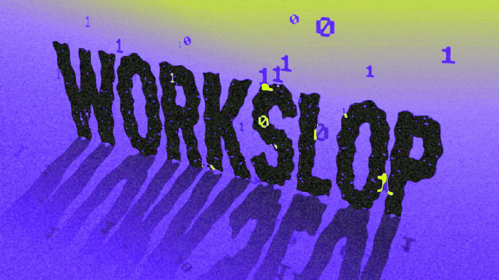虽然 14% 这个比例目前看来不算惊人，但报告作者警告称，这绝对是一个不容忽视的危险信号。当下越来越多的雇主开始强制要求员工使用 AI，甚至将其作为绩效考核的一部分，这无疑在变相鼓励员工过度透支脑力。研究团队在最后给出了一条扎心的建议，打工人们确实可以无限次地让 AI 重新生成和迭代，但这并不意味着你「应该」一直这么干下去。🔗 https://www.axios.com/2026/03/06/ai-chatgpt-claude-jobs-brain-fry彩蛋时间
作者：@RichardNadler1链接：https://x.com/RichardNadler1/status/2028234529891135924欢迎加入 APPSO AI 社群，一起畅聊 AI 产品，获取[#AI有用功](javascript:;)，解锁更多 AI 新知👇我们正在招募伙伴**📮 简历投递邮箱**hr@ifanr.com**✉️ 邮件标题**「姓名+岗位名称」（请随简历附上项目/作品或相关链接）[更多岗位信息请点击这里🔗](https://mp.weixin.qq.com/s?__biz=MjgzMTAwODI0MA==&mid=2652396877&idx=2&sn=dfef25453a6bf0dca147b0adca3deaf7&scene=21#wechat_redirect)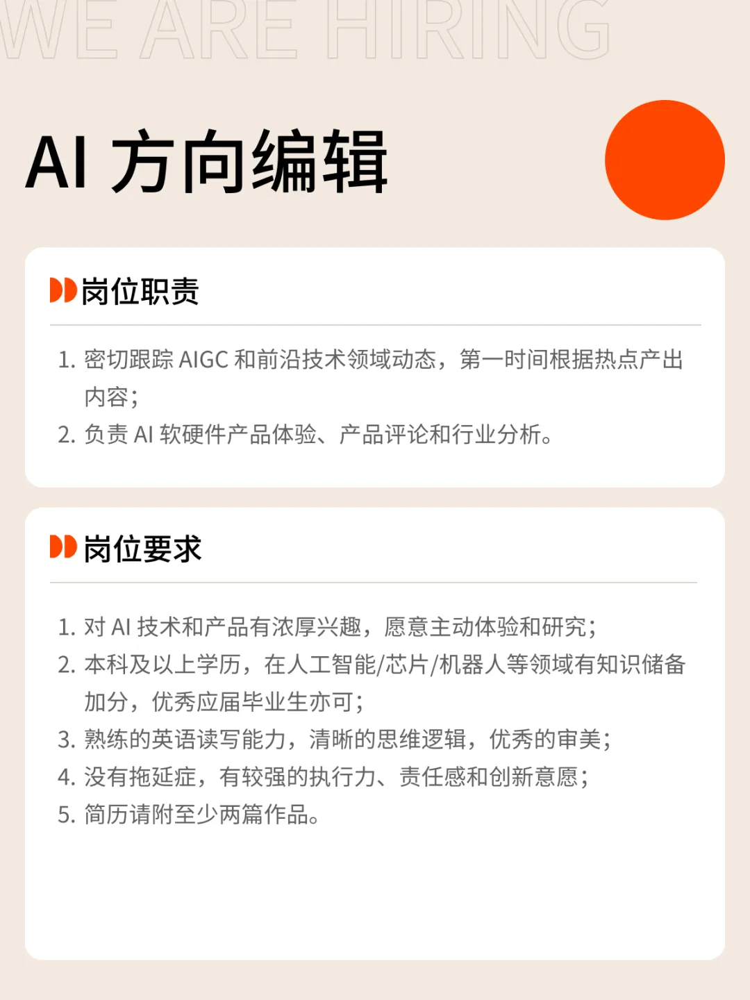
